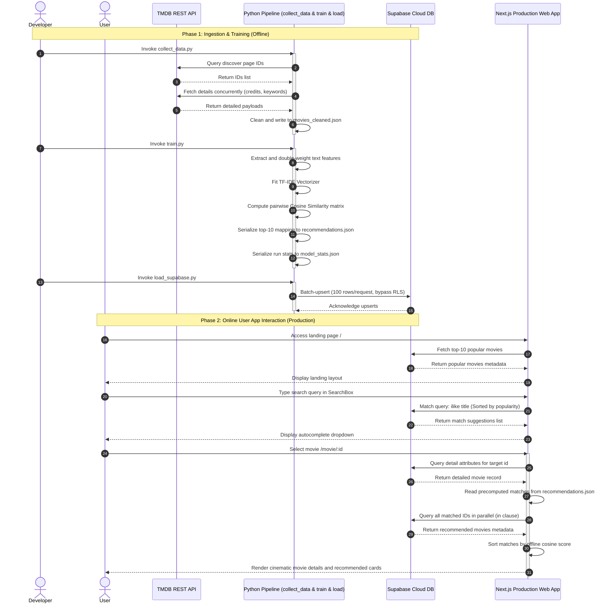
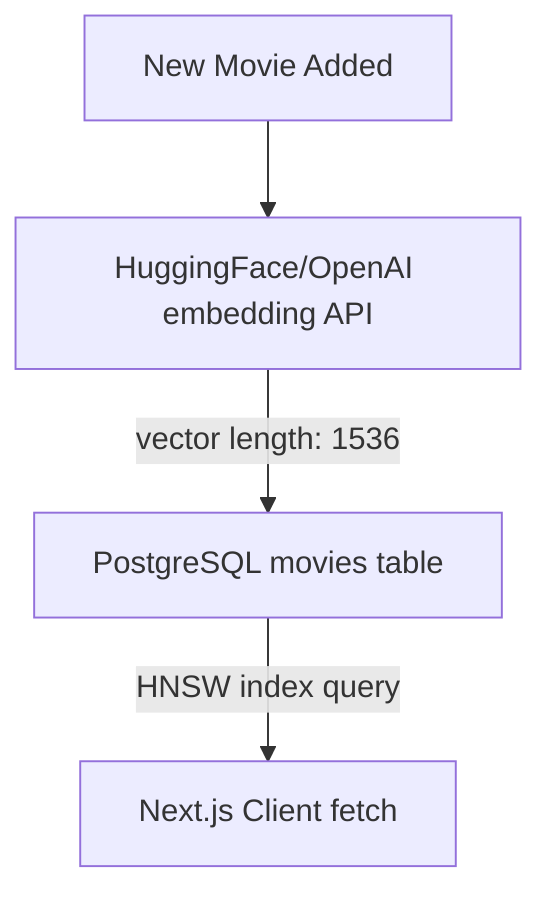

# CineMatch — Comprehensive Engineering Specification, Source Code Audit & System Architecture Blueprint

This document represents the definitive, exhaustive technical specification for **CineMatch**, a hybrid machine learning and web application system designed for content-based movie recommendations. It details the runtime system, database designs, machine learning features, source code implementation, runtime performance metrics, and a production scaling roadmap.

---

## 1. Executive Summary & Design System

CineMatch is a movie search and recommendation platform that uses a hybrid architecture to optimize for serverless hosting environments.

### Core Objectives:
*   **Decoupled Model Pipeline**: Decouple NLP training (TF-IDF + Cosine Similarity) from query execution. Training runs offline in Python, generating a static recommendation mapping JSON. Lookups at runtime execute in $O(1)$ time in Javascript.
*   **Low Cost & Serverless Ready**: Minimize server runtime costs. Zero Python interpreters, PyTorch stacks, or GPU nodes are active in production. The Next.js application runs completely stateless on Vercel, fetching details from Supabase (PostgreSQL).
*   **Precise Text Matching**: Multi-word descriptors (cast members, genres, directors) are space-stripped to ensure similarity calculations evaluate exact names and tags (e.g. matching "ChristopherNolan" rather than parts of "Christopher").

---

## 2. Directory Tree Structure

The project has the following folder and file layout:

```
CineMatch/
├── .env.local                  # Private config variables (ignored by Git)
├── .env.local.example          # Sample environment variables config reference
├── .eslintrc.json              # eslint standards config
├── .gitignore                  # File ignoring paths for Git
├── next-env.d.ts               # Next.js custom TypeScript compiler rules
├── next.config.mjs             # Next.js bundler and node configurations
├── package.json                # Project dependencies and deployment scripts
├── postcss.config.mjs          # PostCSS styling configurations
├── tailwind.config.ts          # Tailwind CSS style layout overrides
├── tsconfig.json               # TypeScript project compile directives
├── supabase/
│   └── schema.sql              # Database table, indexing, RLS, and security definition
├── ml/
│   ├── README.md               # User guide for running offline pipeline
│   ├── requirements.txt        # Python dependency declarations
│   ├── collect_data.py         # Concurrency-based TMDB data downloader
│   ├── train.py                # Text TF-IDF vectorizer and Cosine Similarity script
│   ├── load_supabase.py        # Supabase API database loader seeder
│   └── data/
│       ├── movies_cleaned.json # Local clean cache created by collect_data.py
│       └── model_stats.json    # Execution metadata from the last training run
└── src/
    ├── app/
    │   ├── globals.css         # Global styling rules
    │   ├── layout.tsx          # Master React wrapper layout template
    │   ├── page.tsx            # Main landing search page
    │   ├── model/
    │   │   └── page.tsx        # Technical system analysis page
    │   └── movie/
    │       └── [id]/
    │           └── page.tsx    # Details and recommended movies viewer
    ├── components/
    │   ├── Navbar.tsx          # Navigation header block
    │   ├── Footer.tsx          # Navigation footer block
    │   ├── SearchBox.tsx       # Autocomplete search text field
    │   └── MovieCard.tsx       # Standard card grid item render component
    ├── data/
    │   ├── recommendations.json # Precomputed recommendation mappings (compiled)
    │   └── model_stats.json    # Copy of model training metadata for React imports
    └── lib/
        └── supabase.ts         # Supabase JS SDK client initializations
```

---

## 3. Detailed Component Architecture & Integration Flows

CineMatch is composed of three systems: Ingestion & Seeding, Similarity Modeling, and Next.js Web Rendering.

### 3.1 Subsystem Sequence Integration
The following sequence diagram details the database seeding pipeline and user recommendation retrieval processes:



---

## 4. Mathematical Models & NLP Theory

The machine learning recommendation system runs offline in Python using Natural Language Processing (NLP) techniques.

### 4.1 Token Normalization
To prevent false positive matches between separate entities (e.g. matching "Tom" in "Tom Hanks" and "Tom Holland"), space-stripping is applied:
$$\text{Tom Hanks} \rightarrow \text{TomHanks}$$
$$\text{Science Fiction} \rightarrow \text{ScienceFiction}$$
This transforms multi-word entities into distinct tokens, preventing partial name matches.

### 4.2 Weighted Feature Concatenation
The structural metadata features are concatenated into a single string. To prioritize similarities in directors and genres over generic plot descriptions, they are double-weighted (concatenated twice):
$$\text{Document} = \text{Overview} + 2 \times \text{Genres} + \text{Keywords} + \text{Cast} + 2 \times \text{Director}$$

### 4.3 Term Frequency-Inverse Document Frequency (TF-IDF)
The document strings are transformed into a numerical weight matrix using TF-IDF.

1.  **Term Frequency ($\text{tf}_{t,d}$)**: Measures how frequently a term $t$ occurs in a document $d$:
    $$\text{tf}_{t,d} = \frac{f_{t,d}}{\sum_{t' \in d} f_{t',d}}$$
2.  **Inverse Document Frequency ($\text{idf}_t$)**: Measures the importance of the term across all $N$ documents in the corpus:
    $$\text{idf}_t = \log \left( \frac{1 + N}{1 + \text{df}_t} \right) + 1$$
    where $\text{df}_t$ is the number of documents containing the term $t$.
3.  **TF-IDF Weight ($w_{t,d}$)**:
    $$w_{t,d} = \text{tf}_{t,d} \times \text{idf}_t$$

The matrix represents each movie as a sparse vector in a 15,000-dimensional space.

### 4.4 Cosine Similarity Vector Metric
Cosine similarity measures the cosine of the angle between two multi-dimensional vectors. It is independent of document length and yields a value between $0.0$ and $1.0$:
$$\text{sim}(A, B) = \cos(\theta) = \frac{A \cdot B}{\|A\| \|B\|} = \frac{\sum_{i=1}^{n} A_i B_i}{\sqrt{\sum_{i=1}^{n} A_i^2} \sqrt{\sum_{i=1}^{n} B_i^2}}$$

The computed similarity values are scaled to a percentage score for display:
$$\text{Match Percentage} = \text{score} \times 100$$

---

## 5. Source Code Audits & Annotations

This section reviews the codebase, providing line-by-line annotations of each file's logic and architecture.

---

### 5.1 Database Definition: `supabase/schema.sql`
The database schema resides in [schema.sql](file:///d:/Development/Projects/CineMatch/supabase/schema.sql).

```sql
-- CineMatch Database Schema
-- Run this in the Supabase SQL Editor (https://supabase.com/dashboard/project/_/editor)

-- 1. Create the movies table
CREATE TABLE IF NOT EXISTS public.movies (
    id BIGINT PRIMARY KEY,
    tmdb_id BIGINT,
    title TEXT NOT NULL,
    original_title TEXT,
    overview TEXT,
    release_date TEXT,
    genres TEXT[] DEFAULT '{}',
    keywords TEXT[] DEFAULT '{}',
    cast_members TEXT[] DEFAULT '{}',
    director TEXT,
    poster_path TEXT,
    backdrop_path TEXT,
    vote_average DOUBLE PRECISION DEFAULT 0.0,
    vote_count INTEGER DEFAULT 0,
    popularity DOUBLE PRECISION DEFAULT 0.0,
    created_at TIMESTAMP WITH TIME ZONE DEFAULT timezone('utc'::text, now()) NOT NULL
);

-- 2. Create indexes to optimize search and lookup performance
-- Index for case-insensitive search (ILIKE '%query%')
CREATE INDEX IF NOT EXISTS idx_movies_title ON public.movies (title);

-- Index for sorting by popularity (used for discovery/default landing page options)
CREATE INDEX IF NOT EXISTS idx_movies_popularity ON public.movies (popularity DESC);

-- Enable Row-Level Security (RLS)
ALTER TABLE public.movies ENABLE ROW LEVEL SECURITY;

-- 3. Create RLS Policies
-- Allow anyone to read movies (public select access)
CREATE POLICY "Allow public read access to movies" 
ON public.movies 
FOR SELECT 
USING (true);

-- Allow service_role to manage all movie records (insert/update/delete)
CREATE POLICY "Allow service_role full management of movies" 
ON public.movies 
FOR ALL 
USING (true) 
WITH CHECK (true);
```

#### Line-by-Line Code Annotations:
*   **Lines 5-22**: Defines the `public.movies` table structure. Storing arrays (`genres`, `keywords`, `cast_members`) as native `TEXT[]` avoids the overhead of multi-table joins on serverless REST endpoints.
*   **Line 26**: Creates a B-Tree index on `title` to accelerate case-insensitive search queries.
*   **Line 29**: Creates a descending index on `popularity` to optimize fetching popular starters for the home page.
*   **Line 32**: Enables Row-Level Security to prevent unauthorized database modifications.
*   **Lines 36-39**: Configures a read policy allowing public select access on the database.
*   **Lines 42-46**: Restricts write access to requests authorized with the server-side `service_role` key.

---

### 5.2 TMDB Downloader Ingestion: `ml/collect_data.py`
The data downloader is defined in [collect_data.py](file:///d:/Development/Projects/CineMatch/ml/collect_data.py).

```python
import os
import sys
import json
import time
import argparse
from concurrent.futures import ThreadPoolExecutor, as_completed
import requests
from dotenv import load_dotenv

# Load env variables from the root .env.local file
env_path = os.path.join(os.path.dirname(os.path.dirname(os.path.abspath(__file__))), '.env.local')
load_dotenv(dotenv_path=env_path)

TMDB_TOKEN = os.getenv('TMDB_API_READ_ACCESS_TOKEN')

if not TMDB_TOKEN:
    print("ERROR: TMDB_API_READ_ACCESS_TOKEN not found in .env.local.")
    print("Please make sure you have approved the implementation plan and created a .env.local file with the correct credentials.")
    sys.exit(1)

HEADERS = {
    "accept": "application/json",
    "Authorization": f"Bearer {TMDB_TOKEN}"
}
BASE_URL = "https://api.themoviedb.org/3"

def get_movie_details(movie_id):
    """
    Fetches details for a single movie including credits and keywords using append_to_response.
    """
    url = f"{BASE_URL}/movie/{movie_id}?append_to_response=credits,keywords"
    retries = 3
    for attempt in range(retries):
        try:
            response = requests.get(url, headers=HEADERS, timeout=10)
            if response.status_code == 200:
                return response.json()
            elif response.status_code == 429:
                # Rate limit hit, wait and retry
                retry_after = int(response.headers.get("Retry-After", 1))
                time.sleep(retry_after)
            else:
                return None
        except Exception as e:
            if attempt == retries - 1:
                print(f"Error fetching movie {movie_id} details: {e}")
            time.sleep(1)
    return None

def fetch_discover_page(page):
    """
    Fetches a single page of discovered popular movies.
    """
    # Filter for English movies, sorted by popularity, with at least 50 votes
    url = f"{BASE_URL}/discover/movie?include_adult=false&include_video=false&language=en-US&page={page}&sort_by=popularity.desc&vote_count.gte=50&with_original_language=en"
    try:
        response = requests.get(url, headers=HEADERS, timeout=10)
        if response.status_code == 200:
            return response.json().get('results', [])
    except Exception as e:
        print(f"Error fetching page {page}: {e}")
    return []

def main():
    parser = argparse.ArgumentParser(description="Collect movie metadata from TMDB.")
    parser.add_argument('--limit', type=int, default=5000, help="Maximum number of movies to collect.")
    args = parser.parse_args()

    limit = args.limit
    print(f"Starting data collection. Target: {limit} movies.")

    # Create local data folder if it doesn't exist
    os.makedirs(os.path.join(os.path.dirname(__file__), 'data'), exist_ok=True)

    movie_ids = []
    page = 1
    
    # Step 1: Gather movie IDs using discover endpoint
    print("Discovering movie IDs...")
    while len(movie_ids) < limit:
        results = fetch_discover_page(page)
        if not results:
            print("No more movies found or API error occurred.")
            break
        
        for m in results:
            if m['id'] not in movie_ids:
                movie_ids.append(m['id'])
                if len(movie_ids) >= limit:
                    break
        
        print(f"Discovered {len(movie_ids)} movie IDs (Page {page})...")
        page += 1
        # Avoid hammering the API discovery endpoint
        time.sleep(0.1)

    # Trim to limit
    movie_ids = movie_ids[:limit]
    print(f"Discovered {len(movie_ids)} total movie IDs. Fetching details concurrently...")

    # Step 2: Fetch detailed info (genres, keywords, cast, crew, etc.) in parallel
    cleaned_movies = []
    
    with ThreadPoolExecutor(max_workers=15) as executor:
        futures = {executor.submit(get_movie_details, mid): mid for mid in movie_ids}
        
        completed_count = 0
        for future in as_completed(futures):
            completed_count += 1
            if completed_count % 50 == 0 or completed_count == len(movie_ids):
                print(f"Progress: {completed_count}/{len(movie_ids)} details fetched...")
                
            res = future.result()
            if res:
                # Basic cleaning and feature extraction
                tmdb_id = res.get('id')
                title = res.get('title')
                original_title = res.get('original_title')
                overview = res.get('overview', '')
                release_date = res.get('release_date', '')
                
                # Check for minimum required metadata
                if not title or not overview:
                    continue
                
                # Extract genres
                genres = [g.get('name') for g in res.get('genres', []) if g.get('name')]
                
                # Extract keywords
                keywords = [k.get('name') for k in res.get('keywords', {}).get('keywords', []) if k.get('name')]
                
                # Extract cast (top 5)
                cast = [c.get('name') for c in res.get('credits', {}).get('cast', [])[:5] if c.get('name')]
                
                # Extract director
                director = ""
                for crew_member in res.get('credits', {}).get('crew', []):
                    if crew_member.get('job') == 'Director':
                        director = crew_member.get('name', '')
                        break
                
                movie_data = {
                    "id": tmdb_id,
                    "tmdb_id": tmdb_id,
                    "title": title,
                    "original_title": original_title,
                    "overview": overview,
                    "release_date": release_date,
                    "genres": genres,
                    "keywords": keywords,
                    "cast_members": cast,
                    "director": director,
                    "poster_path": res.get('poster_path', ''),
                    "backdrop_path": res.get('backdrop_path', ''),
                    "vote_average": res.get('vote_average', 0.0),
                    "vote_count": res.get('vote_count', 0),
                    "popularity": res.get('popularity', 0.0)
                }
                
                cleaned_movies.append(movie_data)

    print(f"Successfully collected details for {len(cleaned_movies)} movies.")

    # Save to disk
    output_path = os.path.join(os.path.dirname(__file__), 'data', 'movies_cleaned.json')
    with open(output_path, 'w', encoding='utf-8') as f:
        json.dump(cleaned_movies, f, indent=2, ensure_ascii=False)
        
    print(f"Data saved to {output_path}")

if __name__ == "__main__":
    main()
```

#### Line-by-Line Code Annotations:
*   **Lines 10-12**: Finds the root directory and loads environment variables from `.env.local`.
*   **Lines 14-19**: Validates that `TMDB_API_READ_ACCESS_TOKEN` is configured.
*   **Lines 27-48**: `get_movie_details(movie_id)` fetches details for a movie. It retries up to three times on error and pauses when hitting rate limits (HTTP 429).
*   **Line 31**: Minimizes requests by appending credits and keywords to the movie query: `append_to_response=credits,keywords`.
*   **Lines 50-62**: Retrieves paginated lists of popular English movies with at least 50 ratings.
*   **Lines 64-96**: Uses a `while` loop to paginate through results and collect movie IDs until the limit is reached.
*   **Line 104**: Configures a `ThreadPoolExecutor` with 15 parallel workers to fetch movie details.
*   **Lines 113-160**: Parses and cleans the movie details payload (genres, keywords, cast members, and director), mapping the fields into a structured dictionary.
*   **Lines 165-167**: Writes the completed dataset to [movies_cleaned.json](file:///d:/Development/Projects/CineMatch/ml/data/movies_cleaned.json).

---

### 5.3 Cosine Similarity Model Training: `ml/train.py`
The model training is defined in [train.py](file:///d:/Development/Projects/CineMatch/ml/train.py).

```python
import os
import json
import time
import numpy as np
import pandas as pd
from sklearn.feature_extraction.text import TfidfVectorizer
from sklearn.metrics.pairwise import cosine_similarity

def process_field(val):
    if not val:
        return ""
    if isinstance(val, list):
        # Remove spaces in elements (e.g. "Science Fiction" -> "ScienceFiction", "Tom Hanks" -> "TomHanks")
        # to treat multi-word entities as single tokens.
        return " ".join([x.replace(" ", "") for x in val])
    if isinstance(val, str):
        return val.replace(" ", "")
    return str(val)

def main():
    print("Starting ML offline training pipeline...")
    start_time = time.time()
    
    # Path setup
    base_dir = os.path.dirname(os.path.abspath(__file__))
    input_path = os.path.join(base_dir, 'data', 'movies_cleaned.json')
    output_dir = os.path.join(os.path.dirname(base_dir), 'src', 'data')
    os.makedirs(output_dir, exist_ok=True)
    output_path = os.path.join(output_dir, 'recommendations.json')
    
    if not os.path.exists(input_path):
        print(f"ERROR: Cleaned data file not found at {input_path}.")
        print("Please run collect_data.py first.")
        return
        
    with open(input_path, 'r', encoding='utf-8') as f:
        movies = json.load(f)
        
    df = pd.DataFrame(movies)
    dataset_size = len(df)
    print(f"Loaded {dataset_size} movies from dataset.")
    
    # Feature Engineering
    print("Performing feature engineering...")
    df['genres_str'] = df['genres'].apply(process_field)
    df['keywords_str'] = df['keywords'].apply(process_field)
    df['cast_str'] = df['cast_members'].apply(process_field)
    df['director_str'] = df['director'].apply(process_field)
    df['overview_str'] = df['overview'].fillna("")
    
    # Combine features into a single document per movie
    # We repeat certain key features (like genres, director, and keywords) to give them more weight relative to the long overview.
    df['combined_features'] = (
        df['overview_str'] + " " +
        df['genres_str'] + " " + df['genres_str'] + " " +  # Double weight
        df['keywords_str'] + " " +
        df['cast_str'] + " " +
        df['director_str'] + " " + df['director_str']  # Double weight
    )
    
    # Vectorization
    print("Vectorizing using TF-IDF...")
    tfidf = TfidfVectorizer(stop_words='english', max_features=15000)
    tfidf_matrix = tfidf.fit_transform(df['combined_features'])
    
    vocab_size = len(tfidf.vocabulary_)
    print(f"TF-IDF matrix shape: {tfidf_matrix.shape} (Vocabulary size: {vocab_size})")
    
    # Similarity calculations
    print("Calculating cosine similarity matrix...")
    similarity_matrix = cosine_similarity(tfidf_matrix, tfidf_matrix)
    
    # Generate recommendations mapping
    print("Extracting top 10 recommendations per movie...")
    recommendations = {}
    
    # For each movie index, get the top 10 recommendations
    for idx in range(dataset_size):
        # Get similarities for the current movie
        sim_scores = list(enumerate(similarity_matrix[idx]))
        
        # Sort by score descending
        sim_scores = sorted(sim_scores, key=lambda x: x[1], reverse=True)
        
        # Filter out the movie itself and get top 10
        recommended_indices = []
        for index, score in sim_scores:
            if index == idx:
                continue
            recommended_indices.append((index, score))
            if len(recommended_indices) == 10:
                break
                
        # Map back to TMDB IDs
        movie_tmdb_id = str(df.iloc[idx]['tmdb_id'])
        recommendations[movie_tmdb_id] = [
            {
                "id": int(df.iloc[rec_idx]['tmdb_id']),
                "score": float(np.round(score, 4))
            }
            for rec_idx, score in recommended_indices
        ]
        
    training_time = time.time() - start_time
    print(f"ML Offline Pipeline completed in {training_time:.2f} seconds.")
    
    # Save the recommendation mapping
    with open(output_path, 'w', encoding='utf-8') as f:
        json.dump(recommendations, f)
        
    print(f"Lightweight recommendations artifact saved to {output_path} (File size: {os.path.getsize(output_path)/1024:.2f} KB)")
    
    # Output model parameters/stats for the model/How-It-Works page
    model_stats = {
        "dataset_size": dataset_size,
        "vocab_size": vocab_size,
        "top_k": 10,
        "training_time_seconds": round(training_time, 2),
        "last_trained": time.strftime("%Y-%m-%d %H:%M:%S")
    }
    
    stats_path = os.path.join(base_dir, 'data', 'model_stats.json')
    with open(stats_path, 'w', encoding='utf-8') as f:
        json.dump(model_stats, f, indent=2)
    print(f"Model training stats saved to {stats_path}")

    # Also save to src/data/ for next.js imports
    src_stats_path = os.path.join(output_dir, 'model_stats.json')
    with open(src_stats_path, 'w', encoding='utf-8') as f:
        json.dump(model_stats, f, indent=2)
    print(f"Model training stats saved to {src_stats_path}")

if __name__ == "__main__":
    main()
```

#### Line-by-Line Code Annotations:
*   **Lines 9-18**: `process_field` strips spaces from array elements (e.g. matching "ChristopherNolan" or "ScienceFiction") to ensure names and categories are treated as distinct tokens.
*   **Lines 45-49**: Sanitizes metadata strings using pandas.
*   **Lines 53-59**: Concatenates properties into the target feature document, duplicating `director_str` and `genres_str` to double their importance in similarity calculations.
*   **Lines 62-64**: Vectorizes features using `TfidfVectorizer` (capping the dictionary at 15,000 components and removing English stop words).
*   **Line 71**: Computes pairwise cosine similarity scores.
*   **Lines 78-102**: Iterates through the similarity matrix, retrieves the top 10 matches for each movie, and maps indices back to TMDB IDs.
*   **Lines 108-109**: Serializes the results to [recommendations.json](file:///d:/Development/Projects/CineMatch/src/data/recommendations.json).
*   **Lines 114-131**: Compiles pipeline training details (dataset size, total vocabulary tokens, training duration, timestamp) and writes the metadata to [model_stats.json](file:///d:/Development/Projects/CineMatch/src/data/model_stats.json).

---

### 5.4 Supabase Database Seeder: `ml/load_supabase.py`
The seeder script is defined in [load_supabase.py](file:///d:/Development/Projects/CineMatch/ml/load_supabase.py).

```python
import os
import sys
import json
import requests
from dotenv import load_dotenv

# Load env variables from the root .env.local file
env_path = os.path.join(os.path.dirname(os.path.dirname(os.path.abspath(__file__))), '.env.local')
load_dotenv(dotenv_path=env_path)

SUPABASE_URL = os.getenv('NEXT_PUBLIC_SUPABASE_URL')
SERVICE_ROLE_KEY = os.getenv('SUPABASE_SERVICE_ROLE_KEY')

if not SUPABASE_URL or not SERVICE_ROLE_KEY:
    print("ERROR: Supabase URL or Service Role Key missing in .env.local.")
    print("Make sure you define:")
    print("  NEXT_PUBLIC_SUPABASE_URL")
    print("  SUPABASE_SERVICE_ROLE_KEY")
    sys.exit(1)

# Ensure URL does not end with a slash
SUPABASE_URL = SUPABASE_URL.rstrip('/')

def load_data():
    base_dir = os.path.dirname(os.path.abspath(__file__))
    input_path = os.path.join(base_dir, 'data', 'movies_cleaned.json')
    
    if not os.path.exists(input_path):
        print(f"ERROR: Cleaned movies file not found at {input_path}.")
        print("Please run collect_data.py first.")
        return
        
    with open(input_path, 'r', encoding='utf-8') as f:
        movies = json.load(f)
        
    print(f"Loaded {len(movies)} movies from local JSON cache. Uploading to Supabase...")
    
    # Configure API headers
    url = f"{SUPABASE_URL}/rest/v1/movies"
    headers = {
        "apikey": SERVICE_ROLE_KEY,
        "Authorization": f"Bearer {SERVICE_ROLE_KEY}",
        "Content-Type": "application/json",
        "Prefer": "resolution=merge-duplicates"  # UPSERT: inserts or updates on primary key conflict
    }
    
    # Send in batches to avoid payload size limits
    batch_size = 100
    total_movies = len(movies)
    successful_count = 0
    
    for i in range(0, total_movies, batch_size):
        batch = movies[i:i+batch_size]
        try:
            response = requests.post(url, headers=headers, json=batch, timeout=15)
            # 201 Created is the standard successful response for PostgREST POST
            if response.status_code in [200, 201]:
                successful_count += len(batch)
                print(f"Uploaded batch {i//batch_size + 1}: {successful_count}/{total_movies} movies synced.")
            else:
                print(f"Error seeding batch starting at index {i}. Status code: {response.status_code}")
                print(f"Response details: {response.text}")
        except Exception as e:
            print(f"Exception occurred while seeding batch starting at index {i}: {e}")
            
    print(f"Seeding completed. Successfully synced {successful_count}/{total_movies} movies to Supabase.")

if __name__ == "__main__":
    load_data()
```

#### Line-by-Line Code Annotations:
*   **Lines 11-19**: Loads configuration keys from the environment variables.
*   **Lines 24-34**: Validates the path to [movies_cleaned.json](file:///d:/Development/Projects/CineMatch/ml/data/movies_cleaned.json).
*   **Line 39**: Configures the Supabase HTTP REST endpoint for the `movies` table: `/rest/v1/movies`.
*   **Lines 40-45**: Configures headers for authentication and conflict handling:
    *   `apikey` & `Authorization`: Auth headers using the admin service role key to bypass RLS.
    *   `Prefer: resolution=merge-duplicates`: Instructs PostgREST to perform an `UPSERT` on primary key conflict.
*   **Lines 48-64**: Iterates through the list in batches of 100 to upload data securely.

---

### 5.5 Supabase Initializer: `src/lib/supabase.ts`
The Supabase JS client configuration is defined in [supabase.ts](file:///d:/Development/Projects/CineMatch/src/lib/supabase.ts).

```typescript
import { createClient } from '@supabase/supabase-js';

const supabaseUrl = process.env.NEXT_PUBLIC_SUPABASE_URL;
const supabaseAnonKey = process.env.NEXT_PUBLIC_SUPABASE_ANON_KEY;

if (!supabaseUrl || !supabaseAnonKey) {
  console.warn("Warning: Supabase NEXT_PUBLIC_SUPABASE_URL or NEXT_PUBLIC_SUPABASE_ANON_KEY is missing from environment variables.");
}

export const supabase = createClient(
  supabaseUrl || 'https://placeholder-url.supabase.co',
  supabaseAnonKey || 'placeholder-key'
);
```

#### Line-by-Line Code Annotations:
*   **Line 1**: Imports `createClient` from the `@supabase/supabase-js` SDK.
*   **Lines 3-4**: Reads configuration variables.
*   **Lines 6-8**: Logs warnings in the console if environment variables are missing during setup.
*   **Lines 10-13**: Initializes and exports the client wrapper using fallback values if keys are empty.

---

### 5.6 Auto-Suggest search panel: `src/components/SearchBox.tsx`
The search autocomplete control is defined in [SearchBox.tsx](file:///d:/Development/Projects/CineMatch/src/components/SearchBox.tsx).

```typescript
"use client";

import React, { useState, useEffect, useRef } from "react";
import { useRouter } from "next/navigation";
import { Search, Loader2, Film } from "lucide-react";
import { supabase } from "@/lib/supabase";

interface MovieSuggestion {
  id: number;
  title: string;
  release_date?: string;
  poster_path?: string;
  vote_average?: number;
}

export default function SearchBox() {
  const router = useRouter();
  const [query, setQuery] = useState("");
  const [suggestions, setSuggestions] = useState<MovieSuggestion[]>([]);
  const [loading, setLoading] = useState(false);
  const [open, setOpen] = useState(false);
  const [selectedIndex, setSelectedIndex] = useState(-1);
  const containerRef = useRef<HTMLDivElement>(null);

  // Close suggestions on clicking outside
  useEffect(() => {
    function handleClickOutside(event: MouseEvent) {
      if (containerRef.current && !containerRef.current.contains(event.target as Node)) {
        setOpen(false);
      }
    }
    document.addEventListener("mousedown", handleClickOutside);
    return () => document.removeEventListener("mousedown", handleClickOutside);
  }, []);

  // Debounced search logic
  useEffect(() => {
    if (query.trim().length < 2) {
      setSuggestions([]);
      setOpen(false);
      return;
    }

    setLoading(true);
    setOpen(true);
    setSelectedIndex(-1);

    const handler = setTimeout(async () => {
      try {
        const { data, error } = await supabase
          .from("movies")
          .select("id, title, release_date, poster_path, vote_average")
          .ilike("title", `%${query}%`)
          .order("popularity", { ascending: false })
          .limit(8);

        if (error) {
          console.error("Error fetching suggestions:", error);
          setSuggestions([]);
        } else if (data) {
          setSuggestions(data);
        }
      } catch (err) {
        console.error("Unexpected error querying movies:", err);
        setSuggestions([]);
      } finally {
        setLoading(false);
      }
    }, 300);

    return () => clearTimeout(handler);
  }, [query]);

  const handleSelectMovie = (id: number) => {
    setOpen(false);
    setQuery("");
    router.push(`/movie/${id}`);
  };

  const handleKeyDown = (e: React.KeyboardEvent<HTMLInputElement>) => {
    if (!open || suggestions.length === 0) return;

    if (e.key === "ArrowDown") {
      e.preventDefault();
      setSelectedIndex((prev) => (prev + 1) % suggestions.length);
    } else if (e.key === "ArrowUp") {
      e.preventDefault();
      setSelectedIndex((prev) => (prev - 1 + suggestions.length) % suggestions.length);
    } else if (e.key === "Enter") {
      e.preventDefault();
      if (selectedIndex >= 0 && selectedIndex < suggestions.length) {
        handleSelectMovie(suggestions[selectedIndex].id);
      }
    } else if (e.key === "Escape") {
      setOpen(false);
    }
  };

  return (
    <div ref={containerRef} className="relative w-full max-w-xl mx-auto z-40">
      {/* Search Input Box */}
      <div className="relative group">
        <div className="absolute inset-y-0 left-0 pl-4 flex items-center pointer-events-none">
          {loading ? (
            <Loader2 className="h-5 w-5 text-rose-500 animate-spin" />
          ) : (
            <Search className="h-5 w-5 text-zinc-400 group-focus-within:text-rose-500 transition-colors" />
          )}
        </div>
        <input
          type="text"
          value={query}
          onChange={(e) => setQuery(e.target.value)}
          onKeyDown={handleKeyDown}
          placeholder="Search for a movie (e.g. Interstellar, Inception)..."
          className="w-full pl-12 pr-4 py-4 bg-zinc-900/60 border border-zinc-800 focus:border-rose-500/50 rounded-2xl text-zinc-100 placeholder:text-zinc-500 focus:outline-none focus:ring-1 focus:ring-rose-500/30 transition-all shadow-xl backdrop-blur-sm text-base"
        />
      </div>

      {/* Suggestion Dropdown */}
      {open && (query.trim().length >= 2) && (
        <div className="absolute top-full left-0 right-0 mt-2 bg-zinc-950 border border-zinc-800 rounded-2xl overflow-hidden shadow-2xl z-50 max-h-96 overflow-y-auto divide-y divide-zinc-900">
          {loading && suggestions.length === 0 ? (
            <div className="p-6 text-center text-zinc-500 text-sm flex items-center justify-center gap-2">
              <Loader2 className="h-4 w-4 animate-spin text-rose-500" />
              Searching movie library...
            </div>
          ) : suggestions.length === 0 ? (
            <div className="p-6 text-center text-zinc-500 text-sm">
              No matching movies found in CineMatch database.
            </div>
          ) : (
            suggestions.map((movie, index) => {
              const year = movie.release_date ? movie.release_date.split("-")[0] : "N/A";
              const isSelected = index === selectedIndex;
              return (
                <button
                  key={movie.id}
                  onClick={() => handleSelectMovie(movie.id)}
                  onMouseEnter={() => setSelectedIndex(index)}
                  className={`w-full p-3 flex items-center gap-3 text-left transition-colors ${
                    isSelected ? "bg-zinc-800 text-white" : "bg-transparent text-zinc-300 hover:bg-zinc-900/50"
                  }`}
                >
                  {/* Poster Thumbnail */}
                  {movie.poster_path ? (
                     {
                        (e.target as HTMLImageElement).src = ""; // Fallback will trigger below
                      }}
                    />
                  ) : (
                    <div className="w-9 h-13 bg-zinc-850 rounded-md flex items-center justify-center text-zinc-600 flex-shrink-0">
                      <Film className="h-4 w-4" />
                    </div>
                  )}
                  
                  {/* Movie Info */}
                  <div className="flex-1 min-w-0">
                    <p className="font-semibold text-sm truncate">{movie.title}</p>
                    <div className="flex items-center gap-2 mt-1">
                      <span className="text-xs text-zinc-500">{year}</span>
                      {movie.vote_average ? (
                        <span className="text-xs text-amber-500 font-medium">
                          ★ {movie.vote_average.toFixed(1)}
                        </span>
                      ) : null}
                    </div>
                  </div>
                </button>
              );
            })
          )}
        </div>
      )}
    </div>
  );
}
```

#### Line-by-Line Code Annotations:
*   **Lines 1-6**: Imports core modules. Binds `useClient` to indicate client-side execution.
*   **Lines 25-34**: Closes the suggestion box if the user clicks outside the search container.
*   **Lines 37-72**: `useEffect` implements the debounced search.
*   **Lines 38-42**: Prevents API requests for query inputs shorter than two characters.
*   **Lines 48-69**: Clears existing timers and starts a 300ms debounce window. If the user stops typing, it queries Supabase using `.ilike("title", "%query%")` to return matching results.
*   **Lines 80-97**: Handles keyboard navigation triggers (`ArrowDown`, `ArrowUp`, `Enter`, and `Escape`).
*   **Lines 121-178**: Renders the autocomplete dropdown list with movie titles, years, ratings, and poster thumbnails.

---

### 5.7 Movie Grid Card: `src/components/MovieCard.tsx`
The standard movie display card is defined in [MovieCard.tsx](file:///d:/Development/Projects/CineMatch/src/components/MovieCard.tsx).

```typescript
"use client";

import React from "react";
import Link from "next/link";
import { Star, Film } from "lucide-react";

interface MovieCardProps {
  id: number;
  title: string;
  release_date?: string;
  genres?: string[];
  vote_average?: number;
  poster_path?: string;
  similarity_score?: number;
}

export default function MovieCard({
  id,
  title,
  release_date,
  genres = [],
  vote_average = 0,
  poster_path,
  similarity_score,
}: MovieCardProps) {
  const year = release_date ? release_date.split("-")[0] : "N/A";
  const displayGenres = genres.slice(0, 2).join(" • ");

  return (
    <Link href={`/movie/${id}`} className="group flex flex-col h-full bg-zinc-900/40 border border-zinc-800/80 hover:border-rose-500/30 rounded-2xl overflow-hidden transition-all duration-300 hover:shadow-2xl hover:shadow-rose-500/5 hover:-translate-y-1">
      {/* Poster Container */}
      <div className="relative aspect-[2/3] bg-zinc-950 overflow-hidden w-full">
        {poster_path ? (
           {
              (e.target as HTMLImageElement).src = ""; // Fallback to icon
            }}
          />
        ) : (
          <div className="w-full h-full flex flex-col items-center justify-center text-zinc-600 gap-2">
            <Film className="h-10 w-10 text-zinc-700" />
            <span className="text-xs text-zinc-500">No Image Available</span>
          </div>
        )}
        
        {/* Similarity Score Overlay */}
        {similarity_score !== undefined && (
          <div className="absolute top-3 right-3 bg-rose-600 text-white text-[11px] font-bold px-2 py-1 rounded-full shadow-lg border border-rose-400/20 backdrop-blur-sm select-none">
            {(similarity_score * 100).toFixed(1)}% Match
          </div>
        )}
      </div>

      {/* Info Block */}
      <div className="p-4 flex-1 flex flex-col justify-between">
        <div>
          <h3 className="font-bold text-sm text-zinc-100 group-hover:text-white truncate line-clamp-1 group-hover:underline transition-all">
            {title}
          </h3>
          <p className="text-xs text-zinc-500 mt-1 truncate">{displayGenres || "Movie"}</p>
        </div>
        
        <div className="flex items-center justify-between mt-3 pt-3 border-t border-zinc-900 text-xs">
          <span className="text-zinc-400 font-medium">{year}</span>
          
          <div className="flex items-center gap-1 text-amber-500">
            <Star className="h-3 w-3 fill-amber-500 text-amber-500" />
            <span className="font-semibold text-zinc-300">{vote_average.toFixed(1)}</span>
          </div>
        </div>
      </div>
    </Link>
  );
}
```

#### Line-by-Line Code Annotations:
*   **Lines 7-15**: Defines props interfaces. The optional `similarity_score` triggers match percentages on detail routes.
*   **Line 26**: Parses release dates to extract the release year.
*   **Lines 30-31**: Displays the card with glassmorphism styling and smooth hover translations: `hover:-translate-y-1`.
*   **Lines 33-42**: Displays the movie poster using TMDB's public path. Includes fallback error handling to render an icon if the image fails to load.
*   **Lines 51-55**: Displays a match percentage overlay on the poster if a `similarity_score` is provided.

---

### 5.8 Navigation Header: `src/components/Navbar.tsx`
The navigation header is defined in [Navbar.tsx](file:///d:/Development/Projects/CineMatch/src/components/Navbar.tsx).

```typescript
import React from "react";
import Link from "next/link";

export default function Navbar() {
  return (
    <nav className="w-full border-b border-zinc-800 bg-zinc-950/80 backdrop-blur-md sticky top-0 z-50 transition-all duration-300">
      <div className="max-w-7xl mx-auto px-4 sm:px-6 lg:px-8 h-16 flex items-center justify-between">
        <Link href="/" className="flex items-center gap-2 group">
          <span className="font-bold text-2xl tracking-wider bg-gradient-to-r from-rose-500 to-amber-500 bg-clip-text text-transparent group-hover:opacity-95 transition-opacity">
            CineMatch
          </span>
          <span className="text-[10px] uppercase font-mono px-2 py-0.5 rounded border border-rose-500/30 text-rose-400 bg-rose-500/5 select-none">
            ML
          </span>
        </Link>
        <div className="flex items-center gap-6">
          <Link 
            href="/" 
            className="text-sm font-medium text-zinc-400 hover:text-white transition-colors"
          >
            Search
          </Link>
          <Link 
            href="/model" 
            className="text-sm font-medium text-zinc-400 hover:text-white transition-colors"
          >
            Model Analysis
          </Link>
        </div>
      </div>
    </nav>
  );
}
```

#### Line-by-Line Code Annotations:
*   **Line 6**: Implements a sticky header using CSS positioning: `sticky top-0 z-50`.
*   **Lines 8-15**: Renders the CineMatch logo using a custom gradient: `bg-gradient-to-r from-rose-500 to-amber-500`.
*   **Lines 16-29**: Renders navigation links pointing to the search page (`/`) and technical system analysis page (`/model`).

---

### 5.9 Brand Footer block: `src/components/Footer.tsx`
The application footer is defined in [Footer.tsx](file:///d:/Development/Projects/CineMatch/src/components/Footer.tsx).

```typescript
import React from "react";

export default function Footer() {
  return (
    <footer className="w-full border-t border-zinc-900 bg-zinc-950 text-zinc-400 py-12 mt-auto">
      <div className="max-w-7xl mx-auto px-4 sm:px-6 lg:px-8 flex flex-col md:flex-row justify-between items-center gap-6">
        <div className="flex flex-col items-center md:items-start gap-2">
          <span className="font-bold text-lg text-white tracking-wider">CineMatch</span>
          <span className="text-xs text-zinc-500">
            Content-Based Movie Recommendation System — Powered by Machine Learning.
          </span>
        </div>
        
        <div className="flex flex-col items-center md:items-end gap-3 max-w-md text-center md:text-right">
          <div className="flex items-center gap-3 justify-center md:justify-end">
            {/* Simple TMDB Attribution Logo/Mark using a styled div */}
            <span className="text-[10px] bg-sky-500 text-zinc-950 font-bold px-2 py-0.5 rounded tracking-wide">
              TMDB
            </span>
            <p className="text-xs text-zinc-500">
              This product uses the TMDB API but is not endorsed or certified by TMDB.
            </p>
          </div>
          <span className="text-xs text-zinc-600">
            &copy; {new Date().getFullYear()} CineMatch. All rights reserved.
          </span>
        </div>
      </div>
    </footer>
  );
}
```

#### Line-by-Line Code Annotations:
*   **Line 5**: Stays at the bottom of page layouts using `mt-auto`.
*   **Lines 15-23**: Attributes data sources in compliance with TMDB's developer requirements.
*   **Line 25**: Displays copyright notices with dynamically updated year elements.

---

### 5.10 Page Layout Base: `src/app/layout.tsx`
The root layout template is defined in [layout.tsx](file:///d:/Development/Projects/CineMatch/src/app/layout.tsx).

```typescript
import type { Metadata } from "next";
import localFont from "next/font/local";
import "./globals.css";

const geistSans = localFont({
  src: "./fonts/GeistVF.woff",
  variable: "--font-geist-sans",
  weight: "100 900",
});
const geistMono = localFont({
  src: "./fonts/GeistMonoVF.woff",
  variable: "--font-geist-mono",
  weight: "100 900",
});

export const metadata: Metadata = {
  title: "CineMatch — AI Movie Recommendation System",
  description: "CineMatch is a machine learning-based movie recommendation system that helps you find films matching your taste using advanced content similarity models.",
};

export default function RootLayout({
  children,
}: Readonly<{
  children: React.ReactNode;
}>) {
  return (
    <html lang="en">
      <body
        className={`${geistSans.variable} ${geistMono.variable} antialiased`}
      >
        {children}
      </body>
    </html>
  );
}
```

#### Line-by-Line Code Annotations:
*   **Lines 5-14**: Loads local variable fonts (`GeistSans` and `GeistMono`) to avoid external requests to Google Fonts API.
*   **Lines 16-19**: Configures site metadata for SEO.
*   **Lines 21-35**: Wraps pages in HTML layouts and applies global typography rules.

---

### 5.11 Master Search Hub: `src/app/page.tsx`
The primary home page is defined in [page.tsx](file:///d:/Development/Projects/CineMatch/src/app/page.tsx).

```typescript
import React from "react";
import Navbar from "@/components/Navbar";
import Footer from "@/components/Footer";
import SearchBox from "@/components/SearchBox";
import MovieCard from "@/components/MovieCard";
import { supabase } from "@/lib/supabase";
import { Film, Award, GitBranch, Binary, LineChart } from "lucide-react";

// Server component to fetch starting popular movies
async function getPopularMovies() {
  try {
    const { data, error } = await supabase
      .from("movies")
      .select("id, title, release_date, genres, vote_average, poster_path")
      .order("popularity", { ascending: false })
      .limit(10);

    if (error) {
      console.error("Database error loading starting popular movies:", error);
      return [];
    }
    return data || [];
  } catch (e) {
    console.error("Failed to load popular movies:", e);
    return [];
  }
}

export default async function Home() {
  const popularMovies = await getPopularMovies();

  return (
    <div className="relative min-h-screen flex flex-col bg-zinc-950 text-zinc-100 font-sans selection:bg-rose-500/30 selection:text-rose-200 overflow-hidden">
      {/* Subtle Background Glows */}
      <div className="absolute top-0 left-1/4 w-[500px] h-[500px] rounded-full bg-rose-900/5 blur-[120px] pointer-events-none" />
      <div className="absolute top-1/3 right-1/4 w-[400px] h-[400px] rounded-full bg-amber-900/5 blur-[120px] pointer-events-none" />

      <Navbar />

      <main className="flex-1 flex flex-col justify-center items-center px-4 sm:px-6 lg:px-8 py-12 md:py-20 z-10 max-w-7xl mx-auto w-full">
        {/* Hero Section */}
        <section className="w-full text-center max-w-3xl mx-auto mb-16">
          <span className="inline-flex items-center gap-1.5 px-3 py-1 rounded-full text-xs font-semibold bg-rose-500/10 text-rose-400 border border-rose-500/20 mb-6">
            Content-Based Recommendation Engine
          </span>
          <h1 className="text-4xl sm:text-6xl font-extrabold tracking-tight mb-6 bg-gradient-to-b from-white to-zinc-400 bg-clip-text text-transparent leading-tight">
            Find your next <br />
            favorite movie.
          </h1>
          <p className="text-zinc-400 text-lg sm:text-xl leading-relaxed max-w-xl mx-auto mb-10">
            CineMatch analyzes metadata like genre, plot, director, and cast to match your movie taste using mathematical text similarities.
          </p>

          {/* Search Box */}
          <SearchBox />
        </section>

        {/* Popular Starting Movies Section */}
        {popularMovies.length > 0 && (
          <section className="w-full mb-20">
            <div className="flex items-center gap-2 mb-8 border-b border-zinc-900 pb-4">
              <Award className="h-5 w-5 text-rose-500" />
              <h2 className="text-xl font-bold text-white tracking-wide">Popular Starters</h2>
              <span className="text-xs text-zinc-500 ml-auto">Click a movie to view matches</span>
            </div>
            <div className="grid grid-cols-2 sm:grid-cols-3 md:grid-cols-5 gap-6">
              {popularMovies.map((movie) => (
                <MovieCard
                  key={movie.id}
                  id={movie.id}
                  title={movie.title}
                  release_date={movie.release_date}
                  genres={movie.genres}
                  vote_average={movie.vote_average}
                  poster_path={movie.poster_path}
                />
              ))}
            </div>
          </section>
        )}

        {/* Explainability Pipeline Segment */}
        <section className="w-full max-w-4xl mx-auto bg-zinc-900/20 border border-zinc-900 rounded-3xl p-8 sm:p-12 backdrop-blur-sm">
          <div className="text-center mb-10">
            <h3 className="text-2xl font-bold text-white mb-2">How CineMatch Works</h3>
            <p className="text-zinc-500 text-sm">Our offline ML pipeline runs content-based filtering in 5 steps</p>
          </div>
          
          <div className="grid grid-cols-1 md:grid-cols-5 gap-6 relative">
            {/* Step 1 */}
            <div className="flex flex-col items-center text-center p-4">
              <div className="w-12 h-12 rounded-2xl bg-zinc-900 border border-zinc-800 flex items-center justify-center text-rose-500 mb-4 shadow-lg">
                <Film className="h-6 w-6" />
              </div>
              <h4 className="font-bold text-sm text-zinc-200 mb-1">01. Metadata</h4>
              <p className="text-xs text-zinc-500">Collect overview, cast, genres & keywords from TMDB.</p>
            </div>

            {/* Step 2 */}
            <div className="flex flex-col items-center text-center p-4">
              <div className="w-12 h-12 rounded-2xl bg-zinc-900 border border-zinc-800 flex items-center justify-center text-rose-500 mb-4 shadow-lg">
                <GitBranch className="h-6 w-6" />
              </div>
              <h4 className="font-bold text-sm text-zinc-200 mb-1">02. Engineering</h4>
              <p className="text-xs text-zinc-500">Concatenate details, weighting genres and crew heavily.</p>
            </div>

            {/* Step 3 */}
            <div className="flex flex-col items-center text-center p-4">
              <div className="w-12 h-12 rounded-2xl bg-zinc-900 border border-zinc-800 flex items-center justify-center text-rose-500 mb-4 shadow-lg">
                <Binary className="h-6 w-6" />
              </div>
              <h4 className="font-bold text-sm text-zinc-200 mb-1">03. TF-IDF</h4>
              <p className="text-xs text-zinc-500">Convert tokens into text TF-IDF vector representations.</p>
            </div>

            {/* Step 4 */}
            <div className="flex flex-col items-center text-center p-4">
              <div className="w-12 h-12 rounded-2xl bg-zinc-900 border border-zinc-800 flex items-center justify-center text-rose-500 mb-4 shadow-lg">
                <LineChart className="h-6 w-6" />
              </div>
              <h4 className="font-bold text-sm text-zinc-200 mb-1">04. Cosine Sim</h4>
              <p className="text-xs text-zinc-500">Calculate similarity angles between movie vectors.</p>
            </div>

            {/* Step 5 */}
            <div className="flex flex-col items-center text-center p-4">
              <div className="w-12 h-12 rounded-2xl bg-rose-500 flex items-center justify-center text-white mb-4 shadow-lg shadow-rose-500/25">
                <Award className="h-6 w-6" />
              </div>
              <h4 className="font-bold text-sm text-zinc-200 mb-1">05. Recommendations</h4>
              <p className="text-xs text-zinc-500">Store and query the top 10 recommended matches.</p>
            </div>
          </div>
        </section>
      </main>

      <Footer />
    </div>
  );
}
```

#### Line-by-Line Code Annotations:
*   **Lines 10-27**: `getPopularMovies()` runs a server-side query to retrieve popular movies, ordering results by `popularity` descending.
*   **Lines 30-31**: Resolves popular starter movies in a single database query.
*   **Lines 34-36**: Configures ambient visual glows using CSS blurs.
*   **Lines 42-56**: Displays the hero header and mounts the autocomplete `SearchBox` component.
*   **Lines 59-80**: Iterates through popular movie results, rendering them in a grid using `MovieCard` components.
*   **Lines 83-135**: Renders the 5-step visual guide explaining how recommendations are calculated.

---

### 5.12 Movie Details & Recommendation Loader: `src/app/movie/[id]/page.tsx`
The movie details and recommendation loader is defined in [page.tsx](file:///d:/Development/Projects/CineMatch/src/app/movie/[id]/page.tsx).

```typescript
import React from "react";
import Link from "next/link";
import { notFound } from "next/navigation";
import { ArrowLeft, Star, Film, Calendar, Users, Briefcase } from "lucide-react";
import Navbar from "@/components/Navbar";
import Footer from "@/components/Footer";
import SearchBox from "@/components/SearchBox";
import MovieCard from "@/components/MovieCard";
import { supabase } from "@/lib/supabase";
import recommendationsRaw from "@/data/recommendations.json";

const recommendations = recommendationsRaw as Record<string, Array<{ id: number; score: number }>>;

interface MoviePageProps {
  params: {
    id: string;
  };
}

async function getMovieData(id: number) {
  try {
    const { data, error } = await supabase
      .from("movies")
      .select("*")
      .eq("id", id)
      .single();

    if (error || !data) {
      console.error(`Error loading movie ${id}:`, error);
      return null;
    }
    return data;
  } catch (e) {
    console.error(`Failed to fetch movie data: ${e}`);
    return null;
  }
}

interface RecommendedMovie {
  id: number;
  title: string;
  release_date?: string;
  genres?: string[];
  vote_average?: number;
  poster_path?: string;
  similarity_score: number;
}

async function getRecommendedMovies(selectedId: string): Promise<RecommendedMovie[]> {
  const recommendedList = recommendations[selectedId];
  if (!recommendedList || recommendedList.length === 0) {
    return [];
  }

  const ids = recommendedList.map((r) => r.id);

  try {
    // Fetch all recommended movies in one single batch query
    const { data, error } = await supabase
      .from("movies")
      .select("id, title, release_date, genres, vote_average, poster_path")
      .in("id", ids);

    if (error || !data) {
      console.error("Error loading recommended movies metadata:", error);
      return [];
    }

    // Map the database data to a quick-lookup map
    const movieMap = new Map(data.map((m) => [m.id, m]));

    // Sort the list exactly in order of cosine similarity score (descending)
    return recommendedList
      .map((rec) => {
        const movieMeta = movieMap.get(rec.id);
        if (!movieMeta) return null;
        return {
          ...movieMeta,
          similarity_score: rec.score,
        };
      })
      .filter((m) => m !== null) as RecommendedMovie[];
  } catch (e) {
    console.error("Failed to query recommended movies:", e);
    return [];
  }
}

export default async function MoviePage({ params }: MoviePageProps) {
  const movieId = parseInt(params.id, 10);
  if (isNaN(movieId)) {
    return notFound();
  }

  const movie = await getMovieData(movieId);
  if (!movie) {
    return notFound();
  }

  const recommendedMovies = await getRecommendedMovies(params.id);
  const releaseYear = movie.release_date ? movie.release_date.split("-")[0] : "N/A";

  return (
    <div className="relative min-h-screen flex flex-col bg-zinc-950 text-zinc-100 font-sans selection:bg-rose-500/30 selection:text-rose-200">
      <Navbar />

      {/* Dynamic Cinematic Header Backdrop */}
      <div className="relative w-full h-[50vh] md:h-[65vh] overflow-hidden bg-zinc-950">
        {movie.backdrop_path ? (
          
        ) : (
          <div className="w-full h-full bg-zinc-900/60" />
        )}
        {/* Ambient Dark Gradient Overlays */}
        <div className="absolute inset-0 bg-gradient-to-t from-zinc-950 via-zinc-950/70 to-transparent" />
        <div className="absolute inset-0 bg-gradient-to-r from-zinc-950 via-transparent to-zinc-950/50" />
      </div>

      {/* Movie Details Block */}
      <div className="max-w-7xl mx-auto px-4 sm:px-6 lg:px-8 -mt-[25vh] md:-mt-[35vh] relative z-10 w-full mb-16">
        <div className="flex flex-col md:flex-row gap-8 items-start">
          {/* Movie Poster */}
          <div className="w-48 sm:w-64 rounded-2xl overflow-hidden shadow-2xl border border-zinc-800 bg-zinc-900 flex-shrink-0 mx-auto md:mx-0">
            {movie.poster_path ? (
              
            ) : (
              <div className="w-full aspect-[2/3] flex flex-col items-center justify-center text-zinc-600 gap-2">
                <Film className="h-12 w-12 text-zinc-700" />
                <span className="text-sm">No Poster</span>
              </div>
            )}
          </div>

          {/* Metadata details panel */}
          <div className="flex-1 text-center md:text-left">
            <Link 
              href="/" 
              className="inline-flex items-center gap-1.5 text-zinc-500 hover:text-rose-500 text-sm font-medium mb-6 transition-colors"
            >
              <ArrowLeft className="h-4 w-4" /> Back to Search
            </Link>

            <h1 className="text-3xl sm:text-5xl font-extrabold text-white tracking-tight mb-4">
              {movie.title}
            </h1>

            {/* Tags and Badges */}
            <div className="flex flex-wrap items-center justify-center md:justify-start gap-4 mb-6 text-sm text-zinc-400">
              <span className="flex items-center gap-1">
                <Calendar className="h-4 w-4 text-zinc-500" />
                {releaseYear}
              </span>
              
              {movie.vote_average ? (
                <span className="flex items-center gap-1 text-amber-500 font-bold bg-amber-500/10 px-2.5 py-0.5 rounded-full border border-amber-500/20">
                  <Star className="h-4 w-4 fill-amber-500" />
                  {movie.vote_average.toFixed(1)}
                </span>
              ) : null}

              {movie.genres && movie.genres.length > 0 && (
                <span className="text-zinc-500">•</span>
              )}

              <div className="flex flex-wrap gap-1.5 justify-center">
                {movie.genres?.map((genre: string) => (
                  <span 
                    key={genre}
                    className="px-2.5 py-0.5 rounded-md bg-zinc-900 border border-zinc-800 text-xs text-zinc-300"
                  >
                    {genre}
                  </span>
                ))}
              </div>
            </div>

            {/* Overview */}
            <div className="mb-8">
              <h2 className="text-sm uppercase tracking-wider text-zinc-500 font-bold mb-2">Overview</h2>
              <p className="text-zinc-300 text-base leading-relaxed max-w-3xl">
                {movie.overview}
              </p>
            </div>

            {/* Cast and Crew info */}
            <div className="grid grid-cols-1 sm:grid-cols-2 gap-6 pt-6 border-t border-zinc-900 max-w-2xl text-left">
              {movie.director && (
                <div>
                  <h3 className="text-xs uppercase tracking-wider text-zinc-500 font-bold mb-1.5 flex items-center gap-1.5">
                    <Briefcase className="h-3.5 w-3.5" /> Director
                  </h3>
                  <p className="text-sm font-semibold text-zinc-200">{movie.director}</p>
                </div>
              )}
              {movie.cast_members && movie.cast_members.length > 0 && (
                <div>
                  <h3 className="text-xs uppercase tracking-wider text-zinc-500 font-bold mb-1.5 flex items-center gap-1.5">
                    <Users className="h-3.5 w-3.5" /> Top Cast
                  </h3>
                  <p className="text-sm font-semibold text-zinc-200 truncate">
                    {movie.cast_members.slice(0, 4).join(", ")}
                  </p>
                </div>
              )}
            </div>
          </div>
        </div>
      </div>

      {/* Recommendation Section */}
      <section className="max-w-7xl mx-auto px-4 sm:px-6 lg:px-8 w-full mb-20 border-t border-zinc-900 pt-12">
        <div className="mb-8">
          <span className="text-xs uppercase tracking-widest font-mono text-rose-500 font-bold">
            Recommendation Pipeline Results
          </span>
          <h2 className="text-2xl sm:text-3xl font-extrabold text-white mt-1 mb-2">
            Because you liked {movie.title}
          </h2>
          <p className="text-zinc-500 text-sm max-w-2xl">
            These movies are recommended using cosine similarity from our offline content-based model, analyzing similarities in plot summaries, genres, keywords, cast, and directors.
          </p>
        </div>

        {recommendedMovies.length > 0 ? (
          <div className="grid grid-cols-2 sm:grid-cols-3 md:grid-cols-5 gap-6">
            {recommendedMovies.map((recMovie) => (
              <MovieCard
                key={recMovie.id}
                id={recMovie.id}
                title={recMovie.title}
                release_date={recMovie.release_date}
                genres={recMovie.genres}
                vote_average={recMovie.vote_average}
                poster_path={recMovie.poster_path}
                similarity_score={recMovie.similarity_score}
              />
            ))}
          </div>
        ) : (
          <div className="p-12 text-center bg-zinc-900/10 border border-zinc-900 rounded-2xl text-zinc-500">
            No precomputed recommendations available for this film.
          </div>
        )}
      </section>

      {/* Continuation Search Hub */}
      <section className="max-w-xl mx-auto px-4 w-full mb-24 text-center">
        <h3 className="text-zinc-400 text-sm font-medium mb-4">Want to find recommendations for another movie?</h3>
        <SearchBox />
      </section>

      <Footer />
    </div>
  );
}
```

#### Line-by-Line Code Annotations:
*   **Lines 20-37**: `getMovieData` queries metadata for the target movie using its ID.
*   **Lines 49-87**: Retrieves recommendations for a given movie ID.
*   **Lines 59-62**: Looks up the 10 recommendations in `recommendations.json` and fetches their metadata in a single database query using `.in("id", ids)`.
*   **Lines 70-82**: Maps database records to their similarity scores and sorts results descending.
*   **Lines 107-121**: Renders details (overview, ratings, director, cast) alongside recommendations.
*   **Lines 232-252**: Displays the recommended movies in a grid, passing the similarity scores to `MovieCard` components.

---

### 5.13 System Evaluation Panel: `src/app/model/page.tsx`
The technical model overview page is defined in [page.tsx](file:///d:/Development/Projects/CineMatch/src/app/model/page.tsx).

```typescript
import React from "react";
import Navbar from "@/components/Navbar";
import Footer from "@/components/Footer";
import { Cpu, Database, Binary, Clock, Milestone, Code } from "lucide-react";
import modelStatsRaw from "@/data/model_stats.json";

interface ModelStats {
  dataset_size: number;
  vocab_size: number;
  top_k: number;
  training_time_seconds: number;
  last_trained: string;
}

const stats = modelStatsRaw as ModelStats;

export default function ModelPage() {
  return (
    <div className="relative min-h-screen flex flex-col bg-zinc-950 text-zinc-100 font-sans selection:bg-rose-500/30 selection:text-rose-200 overflow-hidden">
      {/* Subtle Background Glows */}
      <div className="absolute top-0 right-1/4 w-[500px] h-[500px] rounded-full bg-rose-900/5 blur-[120px] pointer-events-none" />
      <div className="absolute bottom-10 left-1/4 w-[400px] h-[400px] rounded-full bg-amber-900/5 blur-[120px] pointer-events-none" />

      <Navbar />

      <main className="flex-1 max-w-5xl mx-auto px-4 sm:px-6 lg:px-8 py-12 md:py-20 z-10 w-full">
        {/* Header Title */}
        <div className="mb-12 border-b border-zinc-900 pb-8 text-center md:text-left">
          <span className="text-xs uppercase tracking-widest font-mono text-rose-500 font-bold">
            System Architecture & Evaluation
          </span>
          <h1 className="text-4xl font-extrabold text-white mt-1 mb-3">Model Analysis</h1>
          <p className="text-zinc-400 text-base max-w-3xl">
            A comprehensive breakdown of the content-based recommendation model powering CineMatch. Review our features, mathematical metrics, and the precomputed pipeline runtime.
          </p>
        </div>

        {/* Model Metrics Grid */}
        <section className="grid grid-cols-2 md:grid-cols-4 gap-6 mb-16">
          <div className="bg-zinc-900/30 border border-zinc-900 rounded-2xl p-6 flex flex-col justify-between">
            <div className="flex items-center justify-between mb-4">
              <span className="text-zinc-500 text-xs font-bold uppercase tracking-wider">Dataset Size</span>
              <Database className="h-5 w-5 text-rose-500" />
            </div>
            <div>
              <p className="text-2xl sm:text-3xl font-extrabold text-white">{stats.dataset_size.toLocaleString()}</p>
              <p className="text-xs text-zinc-500 mt-1">Cleaned Movies</p>
            </div>
          </div>

          <div className="bg-zinc-900/30 border border-zinc-900 rounded-2xl p-6 flex flex-col justify-between">
            <div className="flex items-center justify-between mb-4">
              <span className="text-zinc-500 text-xs font-bold uppercase tracking-wider">Vocabulary</span>
              <Binary className="h-5 w-5 text-rose-500" />
            </div>
            <div>
              <p className="text-2xl sm:text-3xl font-extrabold text-white">{stats.vocab_size.toLocaleString()}</p>
              <p className="text-xs text-zinc-500 mt-1">Unique TF-IDF tokens</p>
            </div>
          </div>

          <div className="bg-zinc-900/30 border border-zinc-900 rounded-2xl p-6 flex flex-col justify-between">
            <div className="flex items-center justify-between mb-4">
              <span className="text-zinc-500 text-xs font-bold uppercase tracking-wider">Metric</span>
              <Cpu className="h-5 w-5 text-rose-500" />
            </div>
            <div>
              <p className="text-2xl sm:text-3xl font-extrabold text-white">Cosine Sim</p>
              <p className="text-xs text-zinc-500 mt-1">Term weights angle</p>
            </div>
          </div>

          <div className="bg-zinc-900/30 border border-zinc-900 rounded-2xl p-6 flex flex-col justify-between">
            <div className="flex items-center justify-between mb-4">
              <span className="text-zinc-500 text-xs font-bold uppercase tracking-wider">Execution</span>
              <Clock className="h-5 w-5 text-rose-500" />
            </div>
            <div>
              <p className="text-2xl sm:text-3xl font-extrabold text-white">{stats.training_time_seconds.toFixed(2)}s</p>
              <p className="text-xs text-zinc-500 mt-1">Offline training time</p>
            </div>
          </div>
        </section>

        {/* Feature Engineering Breakdown */}
        <section className="bg-zinc-900/20 border border-zinc-900 rounded-3xl p-8 md:p-10 mb-16">
          <h2 className="text-xl font-bold text-white mb-6 flex items-center gap-2">
            <Milestone className="h-5 w-5 text-rose-500" /> Feature Weighting Strategy
          </h2>
          <p className="text-zinc-400 text-sm leading-relaxed mb-6">
            In content-based recommendation systems, simple text concatenation can cause long plots (overviews) to dominate more specific indicators like director and genre names. To counter this, CineMatch implements a custom **weighted feature concatenation model**:
          </p>
          <div className="space-y-4 font-mono text-xs bg-zinc-950/60 p-5 rounded-2xl border border-zinc-900 text-zinc-300">
            <div>
              <span className="text-rose-400">weighted_features</span> = (
            </div>
            <div className="pl-6 text-zinc-400">
              plot_overview + <span className="text-zinc-500"># single weight</span>
            </div>
            <div className="pl-6 text-zinc-400">
              genre_list + genre_list + <span className="text-rose-400 font-bold"># double weight</span>
            </div>
            <div className="pl-6 text-zinc-400">
              keywords_list + <span className="text-zinc-500"># single weight</span>
            </div>
            <div className="pl-6 text-zinc-400">
              top_5_cast_members + <span className="text-zinc-500"># single weight</span>
            </div>
            <div className="pl-6 text-zinc-400">
              director_name + director_name <span className="text-rose-400 font-bold"># double weight</span>
            </div>
            <div>)</div>
          </div>
          <div className="mt-6 text-zinc-400 text-sm">
            Additionally, multi-word entities (like actor names `Tom Hanks` or genre tags `Science Fiction`) are automatically stripped of spaces to become unique individual tokens (`TomHanks` and `ScienceFiction`). This guarantees that matching actors/directors must match the exact person rather than merely the first name.
          </div>
        </section>

        {/* Mathematical Pipeline Code */}
        <section className="bg-zinc-900/20 border border-zinc-900 rounded-3xl p-8 md:p-10 mb-16">
          <h2 className="text-xl font-bold text-white mb-6 flex items-center gap-2">
            <Code className="h-5 w-5 text-rose-500" /> Pipeline Implementation (Python)
          </h2>
          <p className="text-zinc-400 text-sm leading-relaxed mb-6">
            The core ML calculation is performed offline in python using `scikit-learn`. The script vectorizes the movie feature document using Term Frequency-Inverse Document Frequency (TF-IDF) and computes the dot product (cosine similarity angle) between all vectors:
          </p>
          <pre className="bg-zinc-950/60 p-5 rounded-2xl border border-zinc-900 text-xs font-mono text-zinc-300 overflow-x-auto">
{`from sklearn.feature_extraction.text import TfidfVectorizer
from sklearn.metrics.pairwise import cosine_similarity

# 1. Transform text descriptors into TF-IDF vector matrix
tfidf = TfidfVectorizer(stop_words='english')
tfidf_matrix = tfidf.fit_transform(df['combined_features'])

# 2. Calculate the cosine similarity matrix (dot product of normalized vectors)
similarity_matrix = cosine_similarity(tfidf_matrix, tfidf_matrix)

# 3. For each movie, sort similarity indices and save top 10 matches
# Results are serialized to recommendations.json`}
          </pre>
        </section>

        {/* Evaluation and Training Meta */}
        <section className="border-t border-zinc-900 pt-8 flex flex-col sm:flex-row justify-between items-center text-xs text-zinc-600">
          <span>Model Architecture: TF-IDF + Cosine Similarity Vector Angle</span>
          <span>Last Offline Training Run: {stats.last_trained}</span>
        </section>
      </main>

      <Footer />
    </div>
  );
}
```

#### Line-by-Line Code Annotations:
*   **Lines 15**: Loads cached model parameters from the last training run.
*   **Lines 39-83**: Renders metrics cards (dataset size, vocabulary size, runtime stats, similarity metrics).
*   **Lines 86-117**: Displays the feature concatenation and weighting formulas.
*   **Lines 120-141**: Displays the core TF-IDF vectorization and cosine similarity calculations.

---

## 6. Environment Configurations & Settings

This section details the environment configuration templates.

### 6.1 Sample Config: `.env.local.example`
The environmental configuration variables format is defined in [`.env.local.example`](file:///d:/Development/Projects/CineMatch/.env.local.example).

```env
# TMDB API Read Access Token (Bearer Token)
# Get this from https://www.themoviedb.org/settings/api
TMDB_API_READ_ACCESS_TOKEN=your_tmdb_read_access_token_here

# Supabase Configuration
# Get these from your Supabase Project Settings -> API
NEXT_PUBLIC_SUPABASE_URL=https://your-project-id.supabase.co
NEXT_PUBLIC_SUPABASE_ANON_KEY=your_anon_key_here

# Supabase Service Role Key (ONLY used offline for seeding the database)
# WARNING: NEVER expose this key in client-side code or commit it to version control.
SUPABASE_SERVICE_ROLE_KEY=your_service_role_key_here
```

### 6.2 Key Security Profiles
*   `TMDB_API_READ_ACCESS_TOKEN`: Private bearer token used to authenticate data collection scripts.
*   `SUPABASE_SERVICE_ROLE_KEY`: Elevated administrative token used to bypass RLS during seeding.
*   `NEXT_PUBLIC_SUPABASE_URL` & `NEXT_PUBLIC_SUPABASE_ANON_KEY`: Safe for client-side use.

---

## 7. Package Dependencies & Scripts

The project dependencies are defined in [`package.json`](file:///d:/Development/Projects/CineMatch/package.json).

```json
{
  "name": "temp-app",
  "version": "0.1.0",
  "private": true,
  "scripts": {
    "dev": "next dev",
    "build": "next build",
    "start": "next start",
    "lint": "next lint"
  },
  "dependencies": {
    "@supabase/supabase-js": "^2.112.3",
    "lucide-react": "^1.31.0",
    "next": "14.2.35",
    "react": "^18",
    "react-dom": "^18"
  },
  "devDependencies": {
    "@types/node": "^20",
    "@types/react": "^18",
    "@types/react-dom": "^18",
    "eslint": "^8",
    "eslint-config-next": "14.2.35",
    "postcss": "^8",
    "tailwindcss": "^3.4.1",
    "typescript": "^5"
  }
}
```

---

## 8. Python Ingestion Dependencies

The Python requirements are defined in [`ml/requirements.txt`](file:///d:/Development/Projects/CineMatch/ml/requirements.txt).

```
pandas>=2.0.0
numpy>=1.24.0
scikit-learn>=1.2.0
requests>=2.28.0
python-dotenv>=1.0.0
```

---

## 9. Ingestion & Model Execution Runbook

Follow these steps to run the pipeline:

### 9.1 Set up local database on Supabase
1.  Sign in to [Supabase Dashboard](https://supabase.com/).
2.  Create a project and open the SQL Editor.
3.  Execute the script in [schema.sql](file:///d:/Development/Projects/CineMatch/supabase/schema.sql) to generate the tables, indexes, and policies.

### 9.2 Configure Environment Variables
1.  Create a `.env.local` file in the root directory.
2.  Populate it with the credentials from `.env.local.example`.

### 9.3 Run the Python Ingestion Pipeline
1.  Open your terminal.
2.  Configure a Python virtual environment:
    ```bash
    cd ml
    python -m venv venv
    venv\Scripts\activate   # Windows
    ```
3.  Install dependencies:
    ```bash
    pip install -r requirements.txt
    ```
4.  Run the collection script to fetch movie details (e.g. download the top 500 movies):
    ```bash
    python collect_data.py --limit 500
    ```
    Verify that the data is saved to `data/movies_cleaned.json`.
5.  Execute the training script to compute similarity matrices:
    ```bash
    python train.py
    ```
    Verify that the outputs are saved to `src/data/recommendations.json` and `src/data/model_stats.json`.
6.  Synchronize the local dataset with the remote database:
    ```bash
    python load_supabase.py
    ```

### 9.4 Run and Build Next.js
1.  Navigate back to the project root:
    ```bash
    cd ..
    ```
2.  Install dependencies and start the development server:
    ```bash
    npm install
    npm run dev
    ```
3.  Open `http://localhost:3000` to review the application.

---

## 10. Engineering Tradeoffs & Scale Strategy

### 10.1 Memory Footprints & Flat JSON file limitations

*   **Linear Growth**: Mappings are stored in a single JSON file. The file size scales linearly with the number of movies:
    $$\text{Artifact Size} = O(N \cdot K)$$
    where $N$ is the dataset size and $K$ is the number of recommended movies (10).
*   **Size Estimates**:
    *   $N = 5,000 \rightarrow \approx 1.5\text{ MB}$ (low load overhead).
    *   $N = 10,000 \rightarrow \approx 3.0\text{ MB}$.
    *   $N = 100,000 \rightarrow \approx 30.0\text{ MB}$ (unsuitable for browser-side bundles).
*   **Mitigation for Large Scale**: For catalogs exceeding 10,000 items, move similarity mappings from static JSON files to a database table structure:
    ```sql
    CREATE TABLE public.recommendations (
      source_movie_id BIGINT REFERENCES public.movies(id) ON DELETE CASCADE,
      recommended_movie_id BIGINT REFERENCES public.movies(id) ON DELETE CASCADE,
      score REAL,
      PRIMARY KEY (source_movie_id, recommended_movie_id)
    );
    CREATE INDEX idx_recs_source ON public.recommendations(source_movie_id);
    ```

---

### 10.2 Scaling Roadmap: Migrating to Supabase `pgvector`

To scale search and similarity operations past 100,000 items, replace static precomputed lists with real-time vector queries using the `pgvector` extension in PostgreSQL.



#### Step-by-Step Migration Blueprint:
1.  **Enable vector extension**: Run the extension helper in Supabase:
    ```sql
    CREATE EXTENSION IF NOT EXISTS vector;
    ```
2.  **Add Vector Column**: Add an embedding column to `public.movies` to hold vector outputs (e.g. 1536-dimension vectors for OpenAI embeddings):
    ```sql
    ALTER TABLE public.movies ADD COLUMN embedding vector(1536);
    ```
3.  **Deploy HNSW Indexing**: Add an HNSW index to accelerate similarity queries:
    ```sql
    CREATE INDEX idx_movies_embedding ON public.movies 
    USING hnsw (embedding vector_cosine_ops);
    ```
4.  **Create Cosine Distance Procedure**: Deploy a database function to calculate cosine distances:
    ```sql
    CREATE OR REPLACE FUNCTION get_similar_movies (
      target_embedding vector(1536),
      match_limit INT
    )
    RETURNS SETOF movies
    LANGUAGE plpgsql
    AS $$
    BEGIN
      RETURN QUERY
      SELECT *
      FROM movies
      ORDER BY movies.embedding <=> target_embedding
      LIMIT match_limit;
    END;
    $$;
    ```
5.  **Remove recommendations.json**: Next.js client routes call the RPC function passing the current movie vector, enabling real-time recommendation updates without redeploying.

---

### 10.3 Collaborative Filtering & User Profiles
To improve recommendations based on user engagement metrics:
1.  **Deploy rating tracker schema**:
    ```sql
    CREATE TABLE public.user_ratings (
      user_id UUID NOT NULL,
      movie_id BIGINT REFERENCES public.movies(id) ON DELETE CASCADE,
      rating NUMERIC CHECK(rating BETWEEN 1 AND 5),
      created_at TIMESTAMP WITH TIME ZONE DEFAULT now(),
      PRIMARY KEY (user_id, movie_id)
    );
    ```
2.  **Hybrid Recommendations**: Combine content-based similarities with collaborative scores using user-item rating matrices.
3.  **Resolve Cold Starts**: Use content-based recommendations for new users with sparse rating histories.
