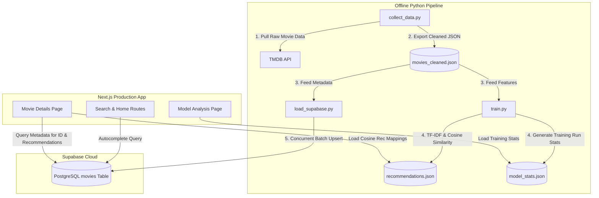
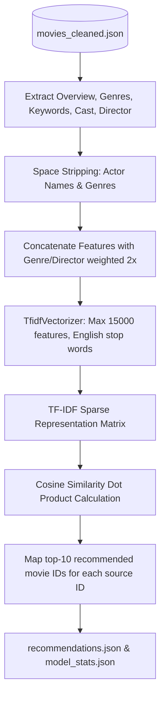

# CineMatch — Engineering Specification

This document provides a comprehensive technical engineering specification for **CineMatch**, an intelligent content-based movie recommendation system. It details the system architecture, database design, offline machine learning pipeline, client-side application structure, and security configurations.

---

## 1. Executive Summary & Objectives

CineMatch is designed to provide movie recommendations using a content-based filtering approach. 

### Key Technical Challenges & Solutions
1. **Low-Latency Rendering**: Running dense machine learning vectors or PyTorch/Scikit-learn servers in production requires expensive, high-maintenance compute and causes page latency. 
   - *Solution*: CineMatch decouples training and inference by computing similarity matrices **offline** in Python. The resulting top-10 recommended movie map is serialized as a lightweight JSON artifact, which is bundled directly with the Next.js serverless application. Recommendation lookup is $O(1)$ at runtime.
2. **Metadata Fetching & Synchronization**: Building a robust movie library requires fetching rich metadata concurrently.
   - *Solution*: A multithreaded Python ingestion engine queries the TMDB API in parallel, processes response data, and batch-upserts clean records into a PostgreSQL database hosted on Supabase using Row-Level Security (RLS).

---

## 2. System Architecture & Component boundaries

The application is split into two independent blocks:
1. **Offline ML & Data Ingestion Pipeline**: Built in Python. Handles TMDB API extraction, TF-IDF feature engineering, cosine similarity computation, recommendation serialization, and database seeding.
2. **Production Web Application**: Built in Next.js (TypeScript/Tailwind/Supabase). Renders the web experience and handles sub-second database queries and recommendation mappings.



### Components Summary

- **TMDB API**: Remote server where raw movie metadata, credits, keywords, and media paths are queried.
- **[collect_data.py](file:///d:/Development/Projects/CineMatch/ml/collect_data.py)**: Multi-threaded Python downloader that queries the TMDB discovery endpoint, filters for high-quality English releases, details credits, and caches to `movies_cleaned.json`.
- **[train.py](file:///d:/Development/Projects/CineMatch/ml/train.py)**: Natural language processing processor that builds feature strings, runs TF-IDF vectorization, computes cosine distances, and exports recommendations mapping to `recommendations.json` and execution metrics to `model_stats.json`.
- **[load_supabase.py](file:///d:/Development/Projects/CineMatch/ml/load_supabase.py)**: Seeder that performs REST-based chunk uploads to the remote Supabase database.
- **Supabase Cloud**: Remote PostgreSQL instance storing details of the catalog. Autocomplete searches hit the index-backed `movies` table.
- **Next.js Web Server**: Next.js 14 serverless application deploying layout structures and executing fast, stateless operations.

---

## 3. Database Schema Design

The project uses a single main table in a Supabase PostgreSQL instance: `public.movies`. The schema is defined in [schema.sql](file:///d:/Development/Projects/CineMatch/supabase/schema.sql).

### Table Schema: `public.movies`

| Column Name | PostgreSQL Type | Constraints | Description |
| :--- | :--- | :--- | :--- |
| `id` | `BIGINT` | `PRIMARY KEY` | Unique movie ID matching TMDB ID. |
| `tmdb_id` | `BIGINT` | - | Duplicate reference for compatibility. |
| `title` | `TEXT` | `NOT NULL` | The localized movie title. |
| `original_title` | `TEXT` | - | Original movie title (for foreign releases). |
| `overview` | `TEXT` | - | Textual summary/plot description of the movie. |
| `release_date` | `TEXT` | - | The release date formatted as `YYYY-MM-DD`. |
| `genres` | `TEXT[]` | `DEFAULT '{}'` | Array of genres (e.g. `{"Science Fiction", "Action"}`). |
| `keywords` | `TEXT[]` | `DEFAULT '{}'` | Array of keywords describing the plot elements. |
| `cast_members` | `TEXT[]` | `DEFAULT '{}'` | Array containing names of the top 5 cast members. |
| `director` | `TEXT` | - | Name of the movie's primary director. |
| `poster_path` | `TEXT` | - | Relative URL path for the TMDB poster image. |
| `backdrop_path` | `TEXT` | - | Relative URL path for the TMDB backdrop image. |
| `vote_average` | `DOUBLE PRECISION` | `DEFAULT 0.0` | Average user rating (0.0 to 10.0). |
| `vote_count` | `INTEGER` | `DEFAULT 0` | Total voter count. |
| `popularity` | `DOUBLE PRECISION` | `DEFAULT 0.0` | TMDB popularity calculation score. |
| `created_at` | `TIMESTAMP WITH TZ` | `DEFAULT timezone('utc'::text, now())` | Creation record timestamp. |

### Indexes
To support efficient and responsive front-end queries:
- **`idx_movies_title`**: Created on `title` to optimize case-insensitive user search queries.
- **`idx_movies_popularity`**: Descending index on `popularity` to optimize fetching popular starters for the home screen layout.

```sql
CREATE INDEX IF NOT EXISTS idx_movies_title ON public.movies (title);
CREATE INDEX IF NOT EXISTS idx_movies_popularity ON public.movies (popularity DESC);
```

### Security & Row-Level Security (RLS)
The database enables Row-Level Security to prevent unauthorized modifications to the movie catalog while keeping reads open to the public:
1. **Public Select Access**: Permitted for all users to read movie data.
   ```sql
   CREATE POLICY "Allow public read access to movies" ON public.movies FOR SELECT USING (true);
   ```
2. **Write/Management Access**: Allowed only for authorized clients utilizing the high-privilege `service_role` credential.
   ```sql
   CREATE POLICY "Allow service_role full management of movies" ON public.movies FOR ALL USING (true) WITH CHECK (true);
   ```

---

## 4. Machine Learning Pipeline Deep Dive

The machine learning system resides in the [ml](file:///d:/Development/Projects/CineMatch/ml) directory and utilizes classical NLP methods to calculate content-based similarity.



### 4.1 Ingestion: `collect_data.py`
The script [collect_data.py](file:///d:/Development/Projects/CineMatch/ml/collect_data.py) fetches movies from TMDB's API using a parallel thread pool:
- **Filtering Parameters**: Queries TMDB’s discover API. Filters for movies in the English language (`with_original_language=en`), sorted by popularity, having at least 50 user ratings (`vote_count.gte=50`).
- **Concurrent Execution**: Utilizes a `ThreadPoolExecutor` with 15 workers to fetch detailed movie configurations (via `append_to_response=credits,keywords` requests) in parallel, boosting download speeds.
- **Throttling & Retries**: Implements robust API retry handling. Intercepts HTTP `429 Too Many Requests` responses and respects TMDB's `Retry-After` header.

### 4.2 Feature Engineering: `train.py`
Feature engineering is defined in [train.py](file:///d:/Development/Projects/CineMatch/ml/train.py) and follows these steps:

1. **Space Stripping & Tokenization**: Multi-word names (like actor `Tom Hanks` or director `Christopher Nolan`) and multi-word genres (like `Science Fiction` or `TV Movie`) are stripped of internal spaces. This turns them into unique tokens (`TomHanks`, `ChristopherNolan`, `ScienceFiction`), ensuring terms match the exact person or category rather than triggering false-positive matches (e.g. matching `Tom` across unrelated cast members).
2. **Feature Concat & Weighting**: The features are combined into a single textual document per movie. Directors and Genres are weighted double (concatenated twice) relative to other features to prioritize structural similarities over generic plot descriptions:
   $$\text{document} = \text{overview} + 2 \times \text{genres} + \text{keywords} + \text{cast} + 2 \times \text{director}$$
3. **TF-IDF Vectorization**: Textual descriptors are transformed using `TfidfVectorizer` (removing standard English stop words and bounding the vocabulary at a maximum of 15,000 features):
   $$w_{i,j} = \text{tf}_{i,j} \times \log\left(\frac{N}{\text{df}_i}\right)$$
4. **Similarity Metric**: We compute the cosine similarity between all document vectors. Cosine similarity calculates the cosine of the angle between two multi-dimensional vectors in space, yielding a value between $-1.0$ and $1.0$ (in our non-negative TF-IDF space, it lies between $0.0$ and $1.0$):
   $$\text{sim}(A, B) = \cos(\theta) = \frac{A \cdot B}{\|A\| \|B\|} = \frac{\sum_{i=1}^{n} A_i B_i}{\sqrt{\sum_{i=1}^{n} A_i^2} \sqrt{\sum_{i=1}^{n} B_i^2}}$$
5. **Lightweight Artifact Generation**:
   - Compiles the top-10 recommended movie mappings for each movie and saves the lookup dictionary to `src/data/recommendations.json`.
   - Compiles pipeline execution details (dataset size, total vocabulary tokens, training duration, timestamp) and saves the metadata to `src/data/model_stats.json`.

### 4.3 Database Synchronization: `load_supabase.py`
The script [load_supabase.py](file:///d:/Development/Projects/CineMatch/ml/load_supabase.py) handles bulk updates of metadata:
- **HTTP Endpoint**: Sends REST requests to the Supabase PostgREST endpoint at `/rest/v1/movies`.
- **UPSERT Strategy**: Includes the header `"Prefer": "resolution=merge-duplicates"`, instructing the database engine to perform upserts based on conflicts with the primary key (`id`).
- **Batching**: Sends movie objects in chunks of 100 to prevent payload size limits and ensure network stability.

---

## 5. Frontend Web Application Architecture

CineMatch is built as a React and Next.js 14 application using the App Router. The UI features a dark, glassmorphic layout styled with Tailwind CSS.

### 5.1 Route Structure & Pages

#### 1. Home / Search Page: [page.tsx](file:///d:/Development/Projects/CineMatch/src/app/page.tsx)
- Renders the primary user landing page.
- Fetches the top 10 most popular movies from Supabase on the server to present as starting recommendations.
- Embeds the client-side search autocomplete and the interactive pipeline explanation steps.

#### 2. Movie Details Page: [page.tsx](file:///d:/Development/Projects/CineMatch/src/app/movie/[id]/page.tsx)
- Resolves the movie ID from the URL params.
- Fetches details for the selected movie from Supabase.
- Looks up recommendation associations from the precomputed `recommendations.json` bundle.
- Executes a fast, batch-lookup query using `.in("id", ids)` to pull metadata for all 10 recommended movies in a single query.
- Sorts and displays the recommended movies by their precomputed cosine similarity score, styled with match percentages (e.g. `92.5% Match`).

#### 3. Model Analysis Page: [page.tsx](file:///d:/Development/Projects/CineMatch/src/app/model/page.tsx)
- Reads metrics directly from the compiled `model_stats.json` file.
- Visualizes key statistics like dataset size, vocabulary size, pipeline runtimes, and the custom feature-weighting formula.

---

### 5.2 Key Components

- **[SearchBox.tsx](file:///d:/Development/Projects/CineMatch/src/components/SearchBox.tsx)**:
  - Client component implementing a debounced text field (300ms).
  - Queries Supabase using case-insensitive partial matching (`.ilike("title", "%query%")`), returning results sorted by popularity.
  - Implements keyboard navigation (supporting `ArrowUp`, `ArrowDown`, `Enter`, and `Escape`).
- **[MovieCard.tsx](file:///d:/Development/Projects/CineMatch/src/components/MovieCard.tsx)**:
  - Renders posters, average ratings, and release years.
  - Formats and displays the similarity score as a rounded percentage overlay.
  - Includes a fallback icon to handle missing or broken poster paths gracefully.
- **[supabase.ts](file:///d:/Development/Projects/CineMatch/src/lib/supabase.ts)**:
  - Initializes the `@supabase/supabase-js` client using public variables.
  - Gracefully handles missing credentials during local setup.

---

## 6. Infrastructure & Deployment Config

### 6.1 Configuration Variables
The project uses environmental variables for client and administrative access:

| Variable Name | Environment | Target | Description |
| :--- | :--- | :--- | :--- |
| `TMDB_API_READ_ACCESS_TOKEN` | Offline Python | Developer | API bearer token for querying movie metadata. |
| `NEXT_PUBLIC_SUPABASE_URL` | Offline & Next.js | Client & Server | URL for the Supabase project instance. |
| `NEXT_PUBLIC_SUPABASE_ANON_KEY` | Next.js Frontend | Client | Low-privilege API key for database reads. |
| `SUPABASE_SERVICE_ROLE_KEY` | Offline Python | Seeder Script | High-privilege API key to bypass RLS. **Do not expose to git.** |

### 6.2 Deployment Pipeline
1. **Frontend Hosting**: Deploy Next.js to Vercel. 
2. **Database Hosting**: Supabase PostgreSQL handles real-time queries.
3. **Build Optimization**: Since recommendations are pre-computed and stored in `recommendations.json`, Vercel builds compile fast, static JSON lookups, enabling sub-second load times.

---

## 7. Limitations & Recommendations for Scale

While CineMatch's architecture is highly optimized for performance and cost, scaling to larger libraries introduces specific trade-offs:

1. **Lightweight Recommendation Artifact Scalability**:
   - *Current Design*: Mappings are stored in a single JSON file.
   - *Trade-off*: File size scales linearly with the number of movies: $O(N \cdot K)$ where $N$ is the dataset size and $K$ is the number of recommended movies (10). For a dataset of 5,000 movies, the file size is ~1.5 MB, which is easily managed by modern browsers. At 100,000 movies, this file grows to 30+ MB, which is too large for client bundles.
   - *Recommendation*: Store recommendations in a relational database table mapping `movie_id` to `recommended_id` with a similarity score, or store them in a Key-Value cache (e.g., Redis).
2. **Real-time Feature Embedding (PgVector)**:
   - *Current Design*: Recommendations are computed offline via a batch script.
   - *Trade-off*: New movies added to the catalog won't show recommendations until the Python pipeline is re-run and the project is redeployed.
   - *Recommendation*: Migrate to an online recommendation system using Supabase's `pgvector` extension. Store movie embeddings in a vector column, generate embeddings for new movies on-demand via a hosted API (e.g. OpenAI's text-embedding models), and perform similarity searches using PostgreSQL cosine similarity operators:
     ```sql
     SELECT * FROM movies 
     ORDER BY embedding <=> current_movie_embedding 
     LIMIT 10;
     ```
3. **Cold-Start & Collaboration**:
   - *Current Design*: Purely content-based.
   - *Trade-off*: Cannot recommend movies based on user search trends, ratings history, or collaborative similarities (user-user matching).
   - *Recommendation*: Evolve the architecture into a hybrid recommendation system by capturing user engagement events and combining content similarity scores with matrix factorization algorithms.
