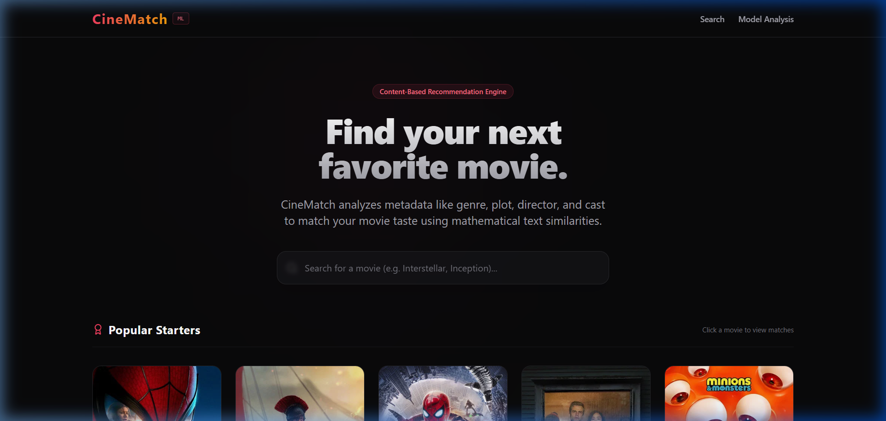
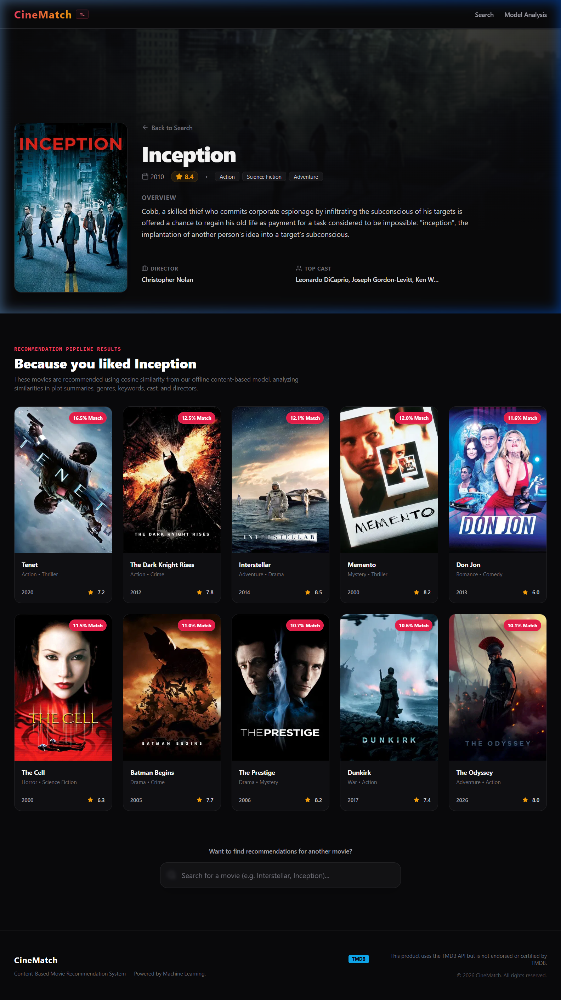
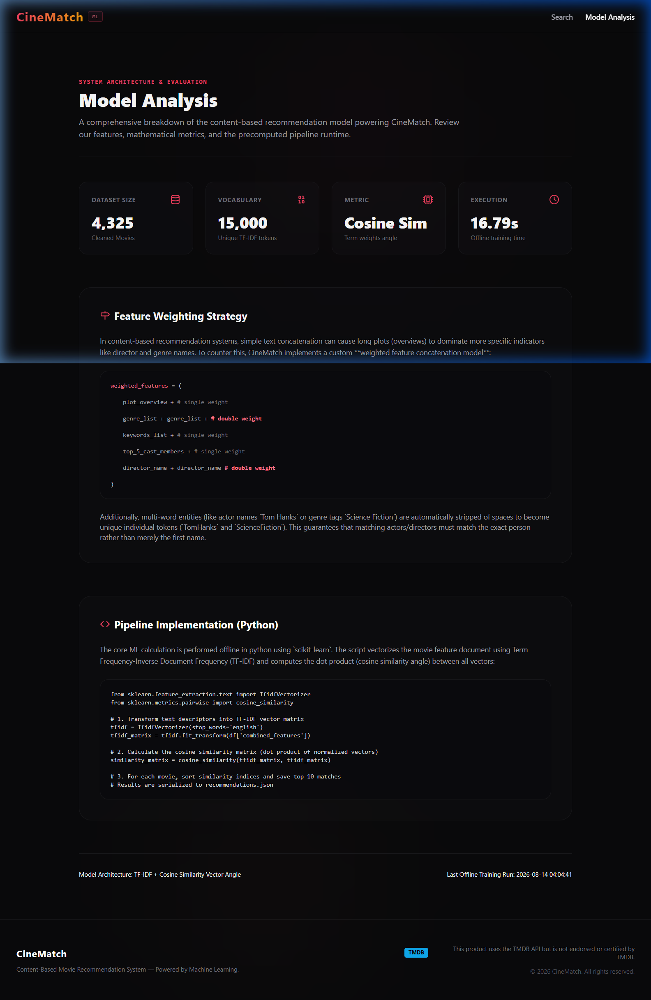
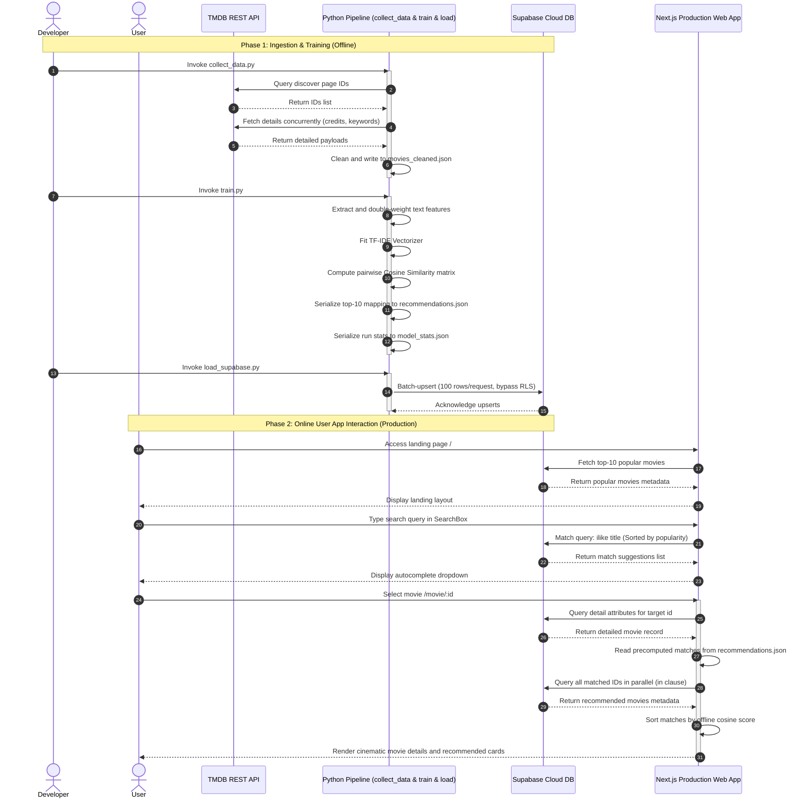

# CineMatch — Content-Based Movie Recommendation System

CineMatch is a movie recommendation web application powered by a real, content-based machine learning pipeline (TF-IDF + Cosine Similarity) that runs offline, paired with a modern, high-performance Next.js frontend integrated with Supabase.

---

## 📸 Application Screenshots

### 1. Dynamic Search Hub
The main landing page features a minimalist, dark-themed hero section, debounced client-side movie search querying our Supabase database, and a grid showing the most popular starter movies.


### 2. Cinematic Detail & Recommendation Display
Selecting a movie opens an immersive detail view showcasing the movie's backdrop, poster, rating, overview, cast list, and director. Below the metadata, it instantly displays the top 10 recommended movies calculated by our ML pipeline with matching similarity percentages.


### 3. Interactive Model Analysis Page
The technical model analysis view presents execution metadata from the latest offline pipeline run, details about vocabulary and dataset size, and an explanation of our feature-weighting and text-tokenization strategies.


---

## ✨ Features

- **High-Fidelity Cinematic UI**: Styled using vanilla CSS and Tailwind CSS, featuring dark-mode aesthetics, smooth hover animations, and responsive grids.
- **Dynamic Search Autocomplete**: Instantly queries the Supabase database using debounced state transitions to display matches on user keystrokes.
- **Precomputed Recommendations**: Runs an offline ML model to generate recommendation maps, storing them in a lightweight JSON mapping table. Lookups in production run in $O(1)$ time with no ML compute overhead.
- **Explainable Similarity Scores**: Each recommended movie displays its calculated similarity percentage (e.g., `92.4% Match`) to represent model confidence.
- **Robust Feature Engineering**: Cleans and weights different TMDB metadata elements (genres, cast, keywords, directors) to achieve maximum recommendation relevance.
- **Compliance & Attribution**: Full compliance with TMDB's developer requirements with proper attribution.

---

## ⚙️ System Architecture

CineMatch implements a decoupled architecture that runs compute-heavy NLP tasks offline in Python and serves the user-facing web interface in a serverless JavaScript runtime.

```
                 TMDB API
                    │
                    ▼
           Python Offline Pipeline (collect_data.py)
                    │
                    ▼
           Movie Dataset (movies_cleaned.json)
                    │
                    ▼
             Feature Engineering (train.py)
                    │
                    ▼
                  TF-IDF
                    │
                    ▼
            Cosine Similarity
                    │
                    ▼
         Top-10 Recommendations
                    │
                    ▼
        Lightweight JSON Artifact (recommendations.json)
                    │
                    ▼
                   Git
                    │
                    ▼
             Next.js / Vercel
                    │
             ┌──────┴──────┐
             ▼             ▼
         Supabase      Recommendation
        Movie Data        Artifact
             │             │
             └──────┬──────┘
                    ▼
                CineMatch Frontend
```

### Ingestion and Runtime Sequence



---

## 🧪 Machine Learning Approach

CineMatch uses a **Content-Based Filtering** algorithm to map similarity:

1. **Feature Engineering**: For each movie, we combine `overview`, `genres` (weighted 2x), `keywords`, `cast_members` (top 5), and `director` (weighted 2x) into a single text document.
2. **Space Stripping (Token Normalization)**: Names and multi-word values are space-stripped (e.g. `Tom Hanks` becomes `TomHanks` and `Science Fiction` becomes `ScienceFiction`) to treat them as single semantic tokens. This prevents partial name matches (e.g. "Tom Hanks" matching "Tom Holland" solely on "Tom").
3. **TF-IDF Vectorization**: Words are converted into high-dimensional numerical term frequency-inverse document frequency vector representations.
4. **Cosine Similarity**: The cosine of the angle between two vectors determines their similarity metric:
   $$\text{sim}(A, B) = \frac{A \cdot B}{\|A\| \|B\|}$$
5. **JSON Lookup**: The top 10 similarity indexes are stored in `src/data/recommendations.json` for fast runtime lookup.

---

## 🛠️ Tech Stack

- **Frontend**: Next.js 14 (App Router), React, TypeScript, Tailwind CSS, Lucide Icons
- **Database**: Supabase (PostgreSQL with RLS policies)
- **Data Source**: TMDB (The Movie Database) API
- **Machine Learning**: Python 3.10+, scikit-learn, pandas, NumPy

---

## 🔑 Environment Variables

To run the application locally, create a `.env.local` file in the root project folder:

```env
# TMDB API Read Access Token (Bearer Token)
TMDB_API_READ_ACCESS_TOKEN=your_tmdb_read_access_token

# Supabase API (Client-side)
NEXT_PUBLIC_SUPABASE_URL=https://your-project-id.supabase.co
NEXT_PUBLIC_SUPABASE_ANON_KEY=your_supabase_anon_key

# Supabase Service Role Key (ONLY used offline for database seeding)
SUPABASE_SERVICE_ROLE_KEY=your_supabase_service_role_key
```

*Ensure `.env.local` is listed in your `.gitignore` to prevent committing sensitive keys.*

---

## 🚀 Setup & Local Development

### 1. Database Setup
1. Create a project in [Supabase](https://supabase.com/).
2. Run the SQL schema from [supabase/schema.sql](./supabase/schema.sql) in the **SQL Editor** of your Supabase dashboard to create the `movies` table and associated indexes.

### 2. Run the Offline ML Pipeline
Navigate to the `ml/` directory and follow the instructions in the [ML Pipeline README](./ml/README.md):
```bash
# Move to ML folder
cd ml

# Set up virtual environment and dependencies
python -m venv venv
source venv/bin/activate  # On Windows: venv\Scripts\activate
pip install -r requirements.txt

# Fetch TMDB data (e.g., limit to 150 for testing, or 5000 for full set)
python collect_data.py --limit 150

# Train & compute similarity
python train.py

# Seed the Supabase database
python load_supabase.py
```

### 3. Run the Next.js Frontend
Once the database is populated and the recommendation mapping is compiled:
```bash
# Return to root directory
cd ..

# Install dependencies
npm install

# Run dev server
npm run dev
```
Open [http://localhost:3000](http://localhost:3000) to view the CineMatch app locally.

---

## ☁️ Vercel Deployment

You can deploy the Next.js web application to Vercel:
1. Connect your repository to Vercel.
2. In the Vercel Dashboard project settings, configure the following environment variables:
   - `NEXT_PUBLIC_SUPABASE_URL`
   - `NEXT_PUBLIC_SUPABASE_ANON_KEY`
3. Click deploy! The precomputed recommendations mapping (`src/data/recommendations.json`) compiles statically, delivering instantaneous recommendation load times in production.

---

## ⚖️ License & Attribution

This application uses the TMDB API but is not officially endorsed or certified by TMDB.
All movie metadata and cover images are provided by [The Movie Database (TMDB)](https://www.themoviedb.org/).
